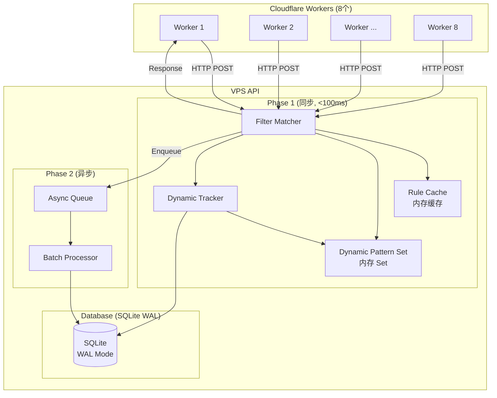

# Design Document: API-Worker Performance Optimization

## Overview

本设计文档描述了优化 VPS API 与多个 Cloudflare Worker 之间通信性能的技术方案。目标是确保 API 在高并发场景下仍能快速响应，避免 Worker 超时导致的统计丢失问题。

### 核心目标

1. **API 响应时间**: 99% 的 webhook 请求在 100ms 内完成 Phase 1 处理
2. **数据库并发**: 支持多个 Worker 同时发送请求，读写不互相阻塞
3. **内存优化**: 使用内存缓存减少数据库查询
4. **Worker 优化**: 减少请求开销，优化超时策略

## Architecture



## Components and Interfaces

### 1. Database Optimization Layer

负责 SQLite 数据库的性能优化配置。

```typescript
interface DatabaseConfig {
  journalMode: 'WAL';
  synchronous: 'NORMAL';
  cacheSize: number;      // 10000 pages (~40MB)
  tempStore: 'MEMORY';
  mmapSize: number;       // 256MB
  busyTimeout: number;    // 5000ms
}

interface DatabaseOptimizer {
  /** 应用性能优化配置 */
  applyOptimizations(db: Database): void;
  
  /** 验证索引存在 */
  verifyIndexes(db: Database): void;
  
  /** 获取查询执行计划 */
  explainQuery(db: Database, sql: string): string;
}
```

### 2. Dynamic Pattern Cache

内存中的动态规则模式缓存，用于 O(1) 时间复杂度的规则查找。

```typescript
interface DynamicPatternCache {
  /** 所有动态规则的 pattern 集合 */
  patterns: Set<string>;
  
  /** 初始化时从数据库加载 */
  loadFromDatabase(db: Database): void;
  
  /** 检查 pattern 是否已存在 */
  has(pattern: string): boolean;
  
  /** 添加新 pattern (规则创建时调用) */
  add(pattern: string): void;
  
  /** 移除 pattern (规则删除时调用) */
  remove(pattern: string): void;
}
```

### 3. Prepared Statement Manager

管理预编译的 SQL 语句，避免重复编译开销。

```typescript
interface PreparedStatementManager {
  /** 获取或创建预编译语句 */
  getStatement(key: string, sql: string): Statement;
  
  /** 预编译常用语句 */
  prepareCommonStatements(db: Database): void;
  
  /** 清理所有语句 */
  cleanup(): void;
}

// 预编译的语句
const PREPARED_STATEMENTS = {
  INSERT_SUBJECT_TRACKER: `
    INSERT INTO email_subject_tracker (subject_hash, subject, received_at)
    VALUES (?, ?, ?)
  `,
  COUNT_SUBJECTS: `
    SELECT COUNT(*) as count FROM email_subject_tracker
    WHERE subject_hash = ? AND received_at >= ?
  `,
  GET_TIMESTAMPS: `
    SELECT received_at FROM email_subject_tracker
    WHERE subject_hash = ? AND received_at >= ?
    ORDER BY received_at ASC
    LIMIT ?
  `,
};
```

### 4. Performance Metrics Collector

收集和记录性能指标。

```typescript
interface PerformanceMetrics {
  /** Phase 1 处理时间直方图 */
  phase1Duration: Histogram;
  
  /** 缓存命中率 */
  cacheHitRate: number;
  
  /** 每秒请求数 */
  requestsPerSecond: number;
  
  /** 记录 Phase 1 时间 */
  recordPhase1Duration(durationMs: number): void;
  
  /** 获取 p95 时间 */
  getP95Duration(): number;
  
  /** 获取统计摘要 */
  getSummary(): MetricsSummary;
}
```

### 5. Worker Request Optimizer

Worker 端的请求优化。

```typescript
interface WorkerRequestOptimizer {
  /** 构建最小化的 payload */
  buildMinimalPayload(email: EmailMessage): WebhookPayload;
  
  /** 缓存解析后的 URL */
  getCachedUrl(urlString: string): URL;
  
  /** 优化的邮件字段提取 */
  extractEmailFields(message: EmailMessage): EmailFields;
}
```

## Data Models

### 数据库索引

```sql
-- 确保存在的索引
CREATE INDEX IF NOT EXISTS idx_subject_tracker_hash_time 
ON email_subject_tracker(subject_hash, received_at);

CREATE INDEX IF NOT EXISTS idx_filter_rules_category 
ON filter_rules(category, enabled);

CREATE INDEX IF NOT EXISTS idx_filter_rules_worker_enabled 
ON filter_rules(worker_id, enabled);
```

### 内存数据结构

```typescript
// 动态规则 pattern 缓存
const dynamicPatternSet: Set<string> = new Set();

// 规则缓存 (已存在)
const ruleCache: Map<string, CacheEntry> = new Map();

// 预编译语句缓存
const preparedStatements: Map<string, Statement> = new Map();

// 性能指标
const metrics: {
  phase1Durations: number[];  // 最近 1000 个请求的 Phase 1 时间
  totalRequests: number;
  cacheHits: number;
  cacheMisses: number;
} = {
  phase1Durations: [],
  totalRequests: 0,
  cacheHits: 0,
  cacheMisses: 0,
};
```

## Correctness Properties

*A property is a characteristic or behavior that should hold true across all valid executions of a system-essentially, a formal statement about what the system should do. Properties serve as the bridge between human-readable specifications and machine-verifiable correctness guarantees.*

### Property 1: WAL 模式下并发读写不阻塞

*For any* database with WAL mode enabled, when a write transaction is in progress, read operations SHALL complete without waiting for the write to finish.

**Validates: Requirements 1.4, 5.3**

### Property 2: Phase 1 处理时间分布

*For any* set of 100 or more webhook requests, at least 99% of requests SHALL have Phase 1 processing time less than 100ms.

**Validates: Requirements 2.1**

### Property 3: 规则缓存命中率

*For any* sequence of webhook requests with the same worker ID, after the first request, subsequent requests within 60 seconds SHALL use cached rules without database query.

**Validates: Requirements 2.2**

### Property 4: 动态 Pattern Set O(1) 查找

*For any* size of the dynamic pattern Set (from 1 to 10000 patterns), the lookup time SHALL remain constant (O(1) time complexity).

**Validates: Requirements 2.4, 4.4**

### Property 5: Subject Hash 计算性能

*For any* email subject string (length 1 to 1000 characters), the hash calculation SHALL complete within 1ms.

**Validates: Requirements 3.3**

### Property 6: 并发请求处理

*For any* set of N concurrent webhook requests (N from 1 to 100), all requests SHALL be processed without serialization (total time < N * single request time).

**Validates: Requirements 5.1**

### Property 7: Worker Payload 最小化

*For any* email message, the webhook payload SHALL not contain null or undefined fields, and the payload size SHALL be minimized.

**Validates: Requirements 9.1**

### Property 8: Worker 字段提取性能

*For any* email message with "from" header (length 1 to 500 characters), the email extraction SHALL complete within 0.1ms.

**Validates: Requirements 9.3**

## Error Handling

### 数据库错误

1. **SQLITE_BUSY**: 当数据库繁忙时，使用 busy_timeout 等待最多 5 秒
2. **SQLITE_LOCKED**: WAL 模式下不应发生，如果发生则记录错误并重试
3. **索引缺失**: 启动时检查并自动创建缺失的索引

### 性能降级

1. **Phase 1 超时**: 如果 Phase 1 处理超过 100ms，记录警告日志
2. **缓存失效**: 如果缓存频繁失效，检查是否有规则频繁更新
3. **内存压力**: 监控内存使用，必要时清理旧的性能指标数据

### Worker 端错误

1. **API 超时**: 4 秒超时后立即 fallback，记录超时事件
2. **网络错误**: 记录错误详情，fallback 到默认转发
3. **解析错误**: 记录错误，使用默认值

## Testing Strategy

### 单元测试

1. **数据库配置测试**: 验证 WAL 模式和 pragmas 正确配置
2. **缓存测试**: 验证规则缓存和 pattern Set 的正确性
3. **哈希函数测试**: 验证 subject hash 的一致性和性能
4. **Payload 构建测试**: 验证最小化 payload 的正确性

### 属性测试

使用 fast-check 库进行属性测试：

1. **并发读写测试**: 生成随机的读写操作序列，验证 WAL 模式下不阻塞
2. **Phase 1 时间测试**: 生成随机 payload，验证处理时间分布
3. **Pattern Set 查找测试**: 生成随机大小的 Set，验证 O(1) 查找
4. **Hash 性能测试**: 生成随机长度的 subject，验证 hash 计算时间

### 性能测试

1. **负载测试**: 模拟 8 个 Worker 同时发送请求
2. **压力测试**: 逐步增加请求量直到性能下降
3. **持久测试**: 长时间运行验证内存泄漏和性能稳定性

### 测试框架

- 单元测试: Vitest
- 属性测试: fast-check
- 性能测试: autocannon 或自定义脚本
