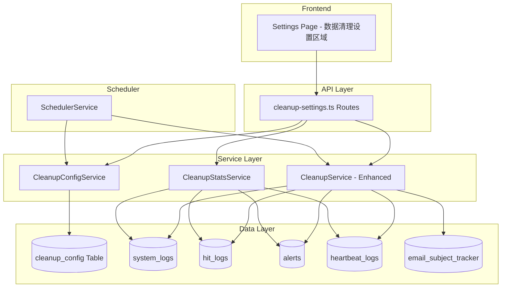

# Design Document: Data Cleanup Settings

## Overview

本设计文档描述了数据清理设置功能的技术实现方案。该功能允许管理员通过前端界面配置各类数据表的自动清理策略，包括保留时间、清理时间等参数，并支持手动触发清理和查看存储统计。

## Architecture



## Components and Interfaces

### 1. CleanupConfigService

负责管理清理配置的持久化和读取。

```typescript
interface CleanupConfig {
  // 系统日志保留天数 (1-365)
  systemLogsRetentionDays: number;
  // 监控命中日志保留小时数 (24-168)
  hitLogsRetentionHours: number;
  // 告警保留天数 (7-365)
  alertsRetentionDays: number;
  // 心跳日志保留天数 (1-90)
  heartbeatLogsRetentionDays: number;
  // 主题追踪保留小时数 (1-72)
  subjectTrackerRetentionHours: number;
  // 清理执行时间 (0-23)
  cleanupHour: number;
  // 是否启用自动清理
  autoCleanupEnabled: boolean;
}

class CleanupConfigService {
  getConfig(): CleanupConfig;
  updateConfig(config: Partial<CleanupConfig>): CleanupConfig;
  validateConfig(config: Partial<CleanupConfig>): ValidationResult;
}
```

### 2. Enhanced CleanupService

扩展现有的 CleanupService，支持所有可清理表。

```typescript
interface CleanupResult {
  systemLogs: { deletedCount: number; cutoffDate: Date };
  hitLogs: { deletedCount: number; cutoffDate: Date };
  alerts: { deletedCount: number; cutoffDate: Date };
  heartbeatLogs: { deletedCount: number; cutoffDate: Date };
  subjectTracker: { deletedCount: number; cutoffDate: Date };
  totalDeleted: number;
  durationMs: number;
  executedAt: Date;
}

class CleanupService {
  // 现有方法
  cleanupHitLogs(retentionHours: number): CleanupResult;
  cleanupAlerts(retentionDays: number): CleanupResult;
  
  // 新增方法
  cleanupSystemLogs(retentionDays: number): CleanupResult;
  cleanupHeartbeatLogs(retentionDays: number): CleanupResult;
  cleanupSubjectTracker(retentionHours: number): CleanupResult;
  
  // 完整清理（使用配置）
  runFullCleanupWithConfig(config: CleanupConfig): FullCleanupResult;
}
```

### 3. CleanupStatsService

提供各表的存储统计信息。

```typescript
interface TableStats {
  tableName: string;
  recordCount: number;
  oldestRecordDate: Date | null;
  newestRecordDate: Date | null;
}

interface CleanupStats {
  tables: TableStats[];
  totalRecords: number;
  lastCleanupAt: Date | null;
  lastCleanupResult: FullCleanupResult | null;
}

class CleanupStatsService {
  getStats(): CleanupStats;
  getTableStats(tableName: string): TableStats;
}
```

### 4. API Routes

```typescript
// GET /api/admin/cleanup/config - 获取清理配置
// PUT /api/admin/cleanup/config - 更新清理配置
// GET /api/admin/cleanup/stats - 获取存储统计
// POST /api/admin/cleanup/run - 手动执行清理
```

### 5. Frontend UI

在设置页面添加"数据清理设置"卡片，包含：
- 各表保留时间配置表单
- 清理时间选择
- 自动清理开关
- 存储统计显示
- 手动清理按钮

## Data Models

### cleanup_config 表

```sql
CREATE TABLE IF NOT EXISTS cleanup_config (
  key TEXT PRIMARY KEY,
  value TEXT NOT NULL,
  updated_at TEXT NOT NULL
);
```

配置键值：
- `system_logs_retention_days`: 系统日志保留天数
- `hit_logs_retention_hours`: 命中日志保留小时数
- `alerts_retention_days`: 告警保留天数
- `heartbeat_logs_retention_days`: 心跳日志保留天数
- `subject_tracker_retention_hours`: 主题追踪保留小时数
- `cleanup_hour`: 清理执行时间
- `auto_cleanup_enabled`: 是否启用自动清理
- `last_cleanup_at`: 上次清理时间
- `last_cleanup_result`: 上次清理结果（JSON）

### 默认配置值

| 配置项 | 默认值 | 范围 |
|--------|--------|------|
| system_logs_retention_days | 30 | 1-365 |
| hit_logs_retention_hours | 72 | 24-168 |
| alerts_retention_days | 90 | 7-365 |
| heartbeat_logs_retention_days | 30 | 1-90 |
| subject_tracker_retention_hours | 24 | 1-72 |
| cleanup_hour | 3 | 0-23 |
| auto_cleanup_enabled | true | boolean |

## Correctness Properties

*A property is a characteristic or behavior that should hold true across all valid executions of a system-essentially, a formal statement about what the system should do. Properties serve as the bridge between human-readable specifications and machine-verifiable correctness guarantees.*

### Property 1: Configuration Validation

*For any* cleanup configuration input, the validation function should accept values within the defined ranges and reject values outside those ranges:
- systemLogsRetentionDays: 1-365
- hitLogsRetentionHours: 24-168
- alertsRetentionDays: 7-365
- heartbeatLogsRetentionDays: 1-90
- subjectTrackerRetentionHours: 1-72
- cleanupHour: 0-23

**Validates: Requirements 1.3, 2.1, 3.1, 3.2, 3.3, 4.1**

### Property 2: Configuration Round-Trip

*For any* valid cleanup configuration, saving to the database and then loading should return an equivalent configuration object.

**Validates: Requirements 1.4**

### Property 3: Cleanup Removes Old Records

*For any* table with records of various timestamps and a configured retention period, after cleanup execution, no records older than the cutoff date should remain in that table.

**Validates: Requirements 2.3, 3.4**

### Property 4: Cleanup Result Contains All Tables

*For any* cleanup execution (manual or scheduled), the result should contain deletion counts for all cleanable tables (systemLogs, hitLogs, alerts, heartbeatLogs, subjectTracker).

**Validates: Requirements 4.3, 5.3**

### Property 5: Statistics Contains All Tables

*For any* call to the statistics API, the response should contain record counts and oldest record dates for all cleanable tables.

**Validates: Requirements 6.1, 6.2**

## Error Handling

1. **配置验证失败**: 返回 400 错误，包含具体的验证错误信息
2. **数据库操作失败**: 返回 500 错误，记录详细日志
3. **清理任务超时**: 设置合理的超时时间，超时后记录已完成的部分
4. **并发清理**: 使用锁机制防止多个清理任务同时执行

## Testing Strategy

### Unit Tests

- 配置验证逻辑测试
- 各表清理方法的边界条件测试
- 统计计算的准确性测试

### Property-Based Tests

使用 fast-check 库进行属性测试：

1. **Property 1**: 生成随机配置值，验证验证函数的正确性
2. **Property 2**: 生成随机有效配置，验证保存/加载的一致性
3. **Property 3**: 生成随机时间戳的记录，验证清理后无过期记录
4. **Property 4**: 执行清理，验证结果包含所有表的计数
5. **Property 5**: 调用统计API，验证响应包含所有表的信息

### Integration Tests

- API 端点的完整流程测试
- 前端与后端的交互测试
- 定时任务的触发测试

