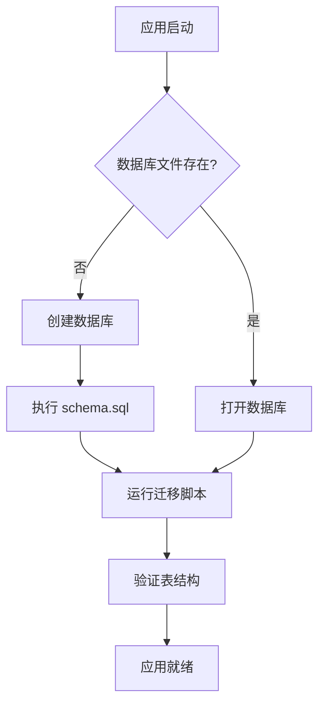

# Design Document: Database Consolidation and Code Cleanup

## Overview

本设计文档描述如何整合分散的数据库 schema 文件、统一迁移机制、清理冗余代码，使项目更易于部署和维护。

## Architecture

### 当前问题

```
packages/vps-api/src/db/
├── schema.sql              # 主 schema（不完整）
├── monitoring-schema.sql   # 监控相关 schema（与主 schema 冲突）
├── campaign-schema.sql     # 营销分析 schema（重复定义）
├── migrate.ts              # 主迁移脚本
├── migrate-add-tags.ts     # 分散的迁移脚本
├── migrate-campaign.ts     # 分散的迁移脚本
├── migrate-monitoring.ts   # 分散的迁移脚本
├── migrate-worker-instance.ts  # 分散的迁移脚本
├── migrate-ratio-monitoring.ts # 分散的迁移脚本
└── migrate-monitoring-worker-scope.ts # 分散的迁移脚本
```

**问题：**
1. `monitoring_rules` 表在 schema.sql 和 monitoring-schema.sql 中定义不同
2. `alerts` 表结构不一致
3. 多个分散的迁移脚本，没有统一管理
4. 代码中存在对旧 schema 文件的引用

### 目标架构

```
packages/vps-api/src/db/
├── schema.sql              # 唯一的完整 schema 文件
├── migrate.ts              # 统一的迁移脚本
├── index.ts                # 数据库初始化
└── *-repository.ts         # Repository 层文件
```

## Components and Interfaces

### 1. 统一 Schema 文件 (schema.sql)

将所有表定义整合到一个文件中，按功能模块分区：

```sql
-- ============================================
-- Core Tables (Worker, Rules, Config)
-- ============================================

-- ============================================
-- System Logs and Statistics
-- ============================================

-- ============================================
-- Email Realtime Monitoring Schema
-- ============================================

-- ============================================
-- Campaign Analytics Schema
-- ============================================

-- ============================================
-- User Authentication Schema
-- ============================================

-- ============================================
-- Ratio Monitoring Tables
-- ============================================
```

### 2. 统一迁移脚本 (migrate.ts)

```typescript
interface Migration {
  name: string;
  description: string;
  check: () => boolean;  // 检查是否需要执行
  execute: () => void;   // 执行迁移
}

class DatabaseMigrator {
  private migrations: Migration[] = [];
  
  register(migration: Migration): void;
  runAll(): MigrationResult[];
  checkStatus(): MigrationStatus[];
}
```

### 3. 数据库初始化流程



## Data Models

### 需要统一的表结构

#### monitoring_rules 表（统一后）

| Column | Type | Description |
|--------|------|-------------|
| id | TEXT | 主键 |
| name | TEXT | 规则名称 |
| merchant | TEXT | 商户标识 |
| subject_pattern | TEXT | 主题匹配模式 |
| expected_interval_minutes | INTEGER | 预期间隔（分钟）|
| dead_after_minutes | INTEGER | 死亡判定时间 |
| tags | TEXT | 标签（JSON数组）|
| worker_scope | TEXT | Worker 范围 |
| enabled | INTEGER | 是否启用 |
| created_at | TEXT | 创建时间 |
| updated_at | TEXT | 更新时间 |

#### alerts 表（统一后）

| Column | Type | Description |
|--------|------|-------------|
| id | TEXT | 主键 |
| rule_id | TEXT | 关联规则 ID |
| alert_type | TEXT | 告警类型 |
| previous_state | TEXT | 之前状态 |
| current_state | TEXT | 当前状态 |
| gap_minutes | INTEGER | 间隔分钟数 |
| count_1h | INTEGER | 1小时计数 |
| count_12h | INTEGER | 12小时计数 |
| count_24h | INTEGER | 24小时计数 |
| message | TEXT | 告警消息 |
| worker_scope | TEXT | Worker 范围 |
| sent_at | TEXT | 发送时间 |
| created_at | TEXT | 创建时间 |

## Correctness Properties

*A property is a characteristic or behavior that should hold true across all valid executions of a system-essentially, a formal statement about what the system should do. Properties serve as the bridge between human-readable specifications and machine-verifiable correctness guarantees.*

### Property 1: Schema completeness after initialization
*For any* fresh database initialization, all required tables SHALL exist with all required columns after schema.sql execution completes.
**Validates: Requirements 1.1, 1.3**

### Property 2: Migration idempotency
*For any* database state, running the migration script multiple times SHALL produce the same final state as running it once, without errors.
**Validates: Requirements 3.1, 3.2**

### Property 3: Foreign key integrity
*For any* table with foreign key references, the referenced table and column SHALL exist in the schema.
**Validates: Requirements 2.4**

### Property 4: Test suite passes
*For any* code change in this consolidation, the full test suite SHALL pass without failures.
**Validates: Requirements 8.1**

## Error Handling

### 迁移错误处理

1. **列已存在**: 使用 `PRAGMA table_info()` 检查后再添加
2. **表已存在**: 使用 `CREATE TABLE IF NOT EXISTS`
3. **外键约束失败**: 按依赖顺序创建表
4. **迁移失败**: 记录错误日志，不中断其他迁移

### 初始化错误处理

1. **Schema 文件不存在**: 抛出明确错误，指导用户检查部署
2. **数据库文件损坏**: 提供备份和重建指导
3. **权限问题**: 检查目录写权限

## Testing Strategy

### 单元测试

- 测试每个迁移函数的幂等性
- 测试 schema 完整性验证函数
- 测试 Repository 层的 CRUD 操作

### 属性测试

使用 fast-check 进行属性测试：

1. **Schema 完整性测试**: 验证所有表和列存在
2. **迁移幂等性测试**: 多次运行迁移不产生错误
3. **外键完整性测试**: 验证所有外键引用有效

### 集成测试

- 测试完整的数据库初始化流程
- 测试从空数据库到完整状态的迁移
- 测试现有数据库的升级迁移

## Files to Modify/Delete

### 需要删除的文件

- `packages/vps-api/src/db/monitoring-schema.sql`
- `packages/vps-api/src/db/campaign-schema.sql`
- `packages/vps-api/src/db/migrate-add-tags.ts`
- `packages/vps-api/src/db/migrate-campaign.ts`
- `packages/vps-api/src/db/migrate-monitoring.ts`
- `packages/vps-api/src/db/migrate-worker-instance.ts`
- `packages/vps-api/src/db/migrate-ratio-monitoring.ts`
- `packages/vps-api/src/db/migrate-monitoring-worker-scope.ts`
- `packages/vps-api/src/db/migrate-match-mode.js`

### 需要修改的文件

- `packages/vps-api/src/db/schema.sql` - 整合所有表定义
- `packages/vps-api/src/db/migrate.ts` - 整合所有迁移逻辑
- `packages/vps-api/src/db/index.ts` - 更新初始化逻辑
- 相关测试文件 - 更新 mock schema
