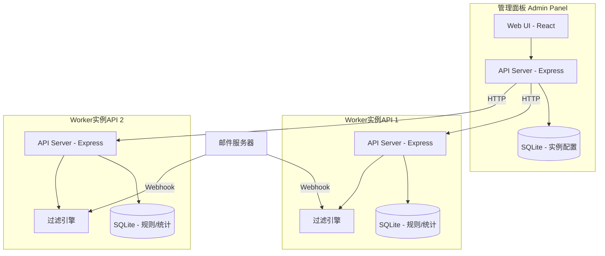
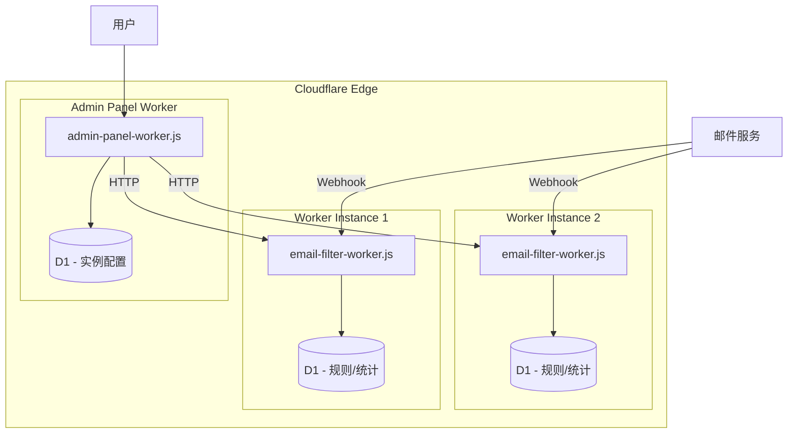
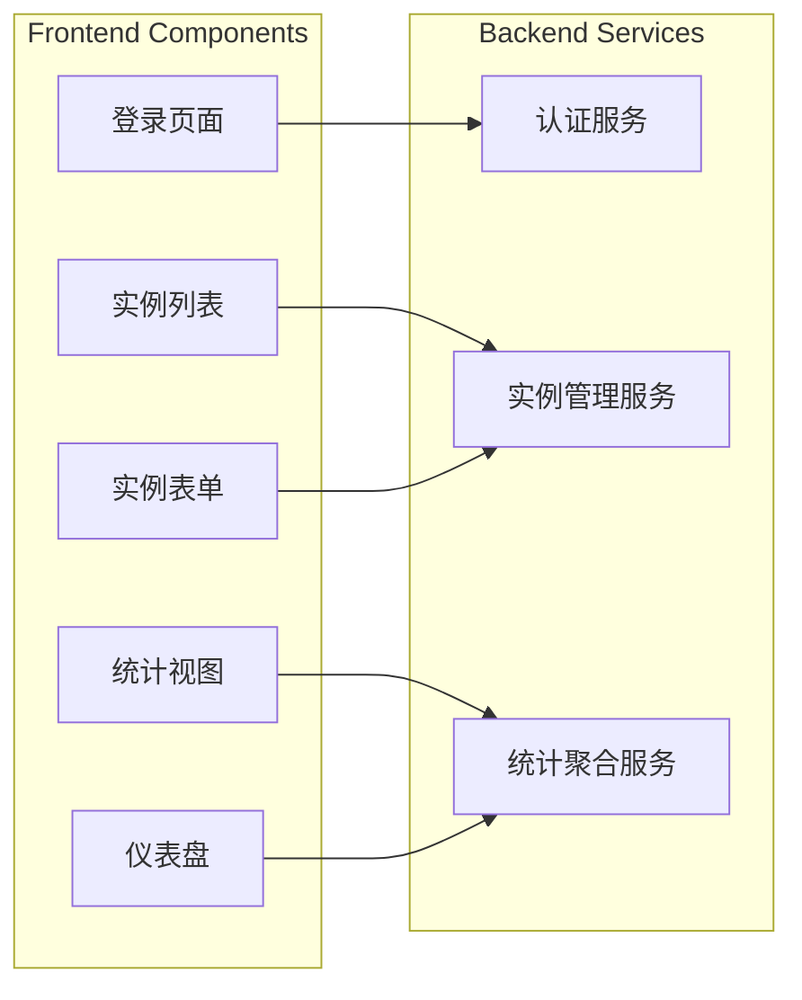
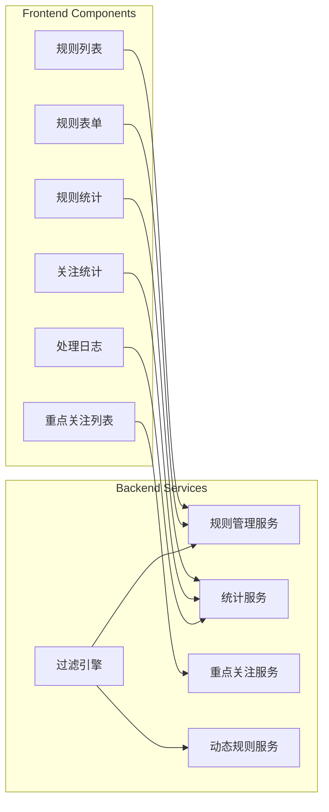

# Design Document

## Overview

邮箱过滤管理工具采用分离式架构设计，由两个独立的系统组成：

1. **管理面板 (Admin Panel)**: 一个集中式Web应用，用于管理多个Worker实例API，提供统一的配置和监控界面
2. **Worker实例API (Worker Instance API)**: 独立部署的邮件过滤服务，负责执行过滤规则、处理邮件和记录统计数据

系统采用前后端分离架构，使用TypeScript/Node.js作为后端技术栈，React作为前端框架，SQLite作为轻量级数据存储。

## Architecture



### 技术选型

| 组件 | 技术 | 理由 |
|------|------|------|
| 运行时 | Cloudflare Workers | 边缘计算、全球部署、无服务器 |
| 后端框架 | Hono + TypeScript | 轻量、专为Workers优化、类型安全 |
| 前端框架 | React + TypeScript | 组件化、生态丰富 |
| 数据库 | Cloudflare D1 (SQLite) | Workers原生支持、无需额外服务 |
| 认证 | JWT | 无状态、易于实现 |
| API通信 | REST | 简单、标准化 |
| 构建工具 | Wrangler + esbuild | 打包为单文件worker.js |

### 部署架构

系统分为两个独立的Worker部署：

1. **admin-panel-worker.js**: 管理面板Worker，包含前端静态资源和后端API
2. **email-filter-worker.js**: 邮件过滤Worker实例API



## Components and Interfaces

### 1. 管理面板组件



#### 管理面板API接口

```typescript
// 认证接口
interface AuthAPI {
  POST /api/auth/login: (password: string) => { token: string }
  POST /api/auth/logout: () => void
  GET /api/auth/verify: () => { valid: boolean }
}

// Worker实例管理接口
interface InstanceAPI {
  GET /api/instances: () => WorkerInstance[]
  POST /api/instances: (instance: CreateInstanceDTO) => WorkerInstance
  PUT /api/instances/:id: (instance: UpdateInstanceDTO) => WorkerInstance
  DELETE /api/instances/:id: () => void
}

// 统计聚合接口
interface StatsAPI {
  GET /api/stats: () => AggregatedStats
  GET /api/stats/:instanceId: () => InstanceStats
}
```

### 2. Worker实例API组件



#### Worker实例API接口

```typescript
// 过滤规则接口
interface RuleAPI {
  GET /api/rules: (category?: RuleCategory) => FilterRule[]
  POST /api/rules: (rule: CreateRuleDTO) => FilterRule
  PUT /api/rules/:id: (rule: UpdateRuleDTO) => FilterRule
  DELETE /api/rules/:id: () => void
  PATCH /api/rules/:id/toggle: () => FilterRule
}

// 邮件处理接口
interface EmailAPI {
  POST /api/email/process: (email: IncomingEmail) => ProcessResult
  GET /api/email/logs: (filter: LogFilter) => ProcessLog[]
}

// 统计接口
interface StatsAPI {
  GET /api/stats/rules: () => RuleStats[]
  GET /api/stats/watch: () => WatchStats[]
  GET /api/stats/summary: () => StatsSummary
}

// 重点关注接口
interface WatchAPI {
  GET /api/watch: () => WatchItem[]
  POST /api/watch: (item: CreateWatchDTO) => WatchItem
  DELETE /api/watch/:id: () => void
}

// 动态规则配置接口
interface DynamicConfigAPI {
  GET /api/dynamic/config: () => DynamicConfig
  PUT /api/dynamic/config: (config: DynamicConfig) => DynamicConfig
}
```

## Data Models

### 管理面板数据模型

```typescript
// Worker实例
interface WorkerInstance {
  id: string;
  name: string;
  apiUrl: string;
  apiKey?: string;
  createdAt: Date;
  updatedAt: Date;
  status: 'active' | 'inactive' | 'error';
}

// 管理员配置
interface AdminConfig {
  passwordHash: string;
  jwtSecret: string;
}
```

### Worker实例API数据模型

```typescript
// 过滤规则
interface FilterRule {
  id: string;
  category: 'whitelist' | 'blacklist' | 'dynamic';
  matchType: 'sender_name' | 'subject' | 'sender_email';
  matchMode: 'regex' | 'contains';
  pattern: string;
  enabled: boolean;
  createdAt: Date;
  updatedAt: Date;
  lastHitAt?: Date;  // 用于动态规则过期检测
}

// 邮件处理记录
interface ProcessLog {
  id: string;
  recipient: string;
  sender: string;
  senderEmail: string;
  subject: string;
  processedAt: Date;
  action: 'passed' | 'deleted' | 'error';
  matchedRuleId?: string;
  matchedRuleCategory?: string;
  errorMessage?: string;
}

// 规则统计
interface RuleStats {
  ruleId: string;
  totalProcessed: number;
  deletedCount: number;
  errorCount: number;
  lastUpdated: Date;
}

// 重点关注项
interface WatchItem {
  id: string;
  subjectPattern: string;
  matchMode: 'regex' | 'contains';
  createdAt: Date;
}

// 重点关注统计
interface WatchStats {
  watchId: string;
  subjectPattern: string;
  totalCount: number;
  last24hCount: number;
  last1hCount: number;
  recipients: string[];  // 命中的收件邮箱列表
}

// 动态规则配置
interface DynamicConfig {
  enabled: boolean;
  timeWindowMinutes: number;      // 检测时间窗口，默认60分钟
  thresholdCount: number;         // 触发阈值，默认50封
  expirationHours: number;        // 过期时间，默认48小时
}

// 邮件输入
interface IncomingEmail {
  recipient: string;
  sender: string;
  senderEmail: string;
  subject: string;
  receivedAt: Date;
}

// 处理结果
interface ProcessResult {
  action: 'passed' | 'deleted';
  matchedRule?: {
    id: string;
    category: string;
    pattern: string;
  };
}
```

### 数据库Schema

```sql
-- 管理面板数据库
CREATE TABLE worker_instances (
  id TEXT PRIMARY KEY,
  name TEXT NOT NULL,
  api_url TEXT NOT NULL,
  api_key TEXT,
  status TEXT DEFAULT 'active',
  created_at DATETIME DEFAULT CURRENT_TIMESTAMP,
  updated_at DATETIME DEFAULT CURRENT_TIMESTAMP
);

CREATE TABLE admin_config (
  key TEXT PRIMARY KEY,
  value TEXT NOT NULL
);

-- Worker实例API数据库
CREATE TABLE filter_rules (
  id TEXT PRIMARY KEY,
  category TEXT NOT NULL,
  match_type TEXT NOT NULL,
  match_mode TEXT NOT NULL,
  pattern TEXT NOT NULL,
  enabled INTEGER DEFAULT 1,
  created_at DATETIME DEFAULT CURRENT_TIMESTAMP,
  updated_at DATETIME DEFAULT CURRENT_TIMESTAMP,
  last_hit_at DATETIME
);

CREATE TABLE process_logs (
  id TEXT PRIMARY KEY,
  recipient TEXT NOT NULL,
  sender TEXT NOT NULL,
  sender_email TEXT NOT NULL,
  subject TEXT NOT NULL,
  processed_at DATETIME DEFAULT CURRENT_TIMESTAMP,
  action TEXT NOT NULL,
  matched_rule_id TEXT,
  matched_rule_category TEXT,
  error_message TEXT
);

CREATE TABLE rule_stats (
  rule_id TEXT PRIMARY KEY,
  total_processed INTEGER DEFAULT 0,
  deleted_count INTEGER DEFAULT 0,
  error_count INTEGER DEFAULT 0,
  last_updated DATETIME DEFAULT CURRENT_TIMESTAMP
);

CREATE TABLE watch_items (
  id TEXT PRIMARY KEY,
  subject_pattern TEXT NOT NULL,
  match_mode TEXT NOT NULL,
  created_at DATETIME DEFAULT CURRENT_TIMESTAMP
);

CREATE TABLE watch_hits (
  id TEXT PRIMARY KEY,
  watch_id TEXT NOT NULL,
  recipient TEXT NOT NULL,
  hit_at DATETIME DEFAULT CURRENT_TIMESTAMP,
  FOREIGN KEY (watch_id) REFERENCES watch_items(id)
);

CREATE TABLE dynamic_config (
  key TEXT PRIMARY KEY,
  value TEXT NOT NULL
);

-- 用于动态规则检测的临时表
CREATE TABLE email_subject_tracker (
  subject_hash TEXT NOT NULL,
  subject TEXT NOT NULL,
  received_at DATETIME DEFAULT CURRENT_TIMESTAMP
);

CREATE INDEX idx_subject_tracker_hash ON email_subject_tracker(subject_hash);
CREATE INDEX idx_subject_tracker_time ON email_subject_tracker(received_at);
```


## Correctness Properties

*A property is a characteristic or behavior that should hold true across all valid executions of a system-essentially, a formal statement about what the system should do. Properties serve as the bridge between human-readable specifications and machine-verifiable correctness guarantees.*

### Property 1: Worker实例CRUD一致性
*For any* Worker实例数据，创建实例后查询应返回相同数据，修改后查询应返回更新后的数据，删除后查询应返回空结果。
**Validates: Requirements 1.1, 1.2, 1.3, 1.4**

### Property 2: 认证正确性
*For any* 密码字符串，使用正确密码登录应成功获取有效token，使用错误密码登录应被拒绝，登出后token应失效。
**Validates: Requirements 2.2, 2.3, 2.4**

### Property 3: 过滤规则匹配正确性
*For any* 过滤规则和邮件，当规则的matchType为sender_name时应匹配发件人显示名称，为subject时应匹配邮件主题，为sender_email时应匹配发件邮箱地址。
**Validates: Requirements 4.1, 4.2, 4.3**

### Property 4: 匹配模式正确性
*For any* 过滤规则和测试字符串，当matchMode为regex时应使用正则表达式匹配，为contains时应使用包含匹配。
**Validates: Requirements 4.4, 4.5**

### Property 5: 白名单优先级
*For any* 同时匹配白名单和黑名单/动态名单的邮件，处理结果应为passed（允许通过），而非deleted。
**Validates: Requirements 5.1**

### Property 6: 黑名单和动态名单过滤
*For any* 匹配黑名单或动态名单但不匹配白名单的邮件，处理结果应为deleted。
**Validates: Requirements 5.2, 5.3**

### Property 7: 规则启用状态生效
*For any* 过滤规则，当enabled为false时，该规则不应匹配任何邮件；当enabled为true时，该规则应正常参与匹配。
**Validates: Requirements 5.4**

### Property 8: 规则删除级联
*For any* 被删除的过滤规则，删除后该规则的统计数据也应被删除，查询规则和统计都应返回空。
**Validates: Requirements 5.5, 8.3**

### Property 9: 动态规则自动生成
*For any* 在配置的时间窗口内收到超过阈值数量的相同主题邮件，系统应自动创建一条动态名单规则。
**Validates: Requirements 6.1**

### Property 10: 动态规则过期清理
*For any* 动态规则，当其lastHitAt超过配置的过期时间后，该规则应被自动删除。
**Validates: Requirements 6.2**

### Property 11: 动态规则时间戳更新
*For any* 被命中的动态规则，其lastHitAt字段应更新为当前时间。
**Validates: Requirements 6.3, 6.4**

### Property 12: 邮件处理日志完整性
*For any* 被处理的邮件，处理日志应包含recipient、sender、subject和action字段，且当邮件命中规则时应包含matchedRuleId。
**Validates: Requirements 7.1, 7.2**

### Property 13: 处理日志筛选正确性
*For any* 日志筛选条件，返回的日志应全部满足指定的时间范围、处理方式和规则类型条件。
**Validates: Requirements 7.3**

### Property 14: 规则统计准确性
*For any* 被规则命中的邮件，对应规则的统计计数应正确递增（totalProcessed增加，根据action增加deletedCount或errorCount）。
**Validates: Requirements 8.1, 8.2, 8.4**

### Property 15: 重点关注CRUD一致性
*For any* 重点关注项，添加后应可查询到，删除后应查询不到。
**Validates: Requirements 9.1**

### Property 16: 重点关注统计准确性
*For any* 匹配重点关注主题的邮件，统计数据应正确更新，包括totalCount递增和recipients列表包含该邮件的收件人。
**Validates: Requirements 9.2, 9.3, 9.4**

### Property 17: 规则验证
*For any* 创建规则请求，当pattern为空或matchType/matchMode无效时应拒绝创建，当格式有效时应成功创建。
**Validates: Requirements 10.1**

### Property 18: 数据持久化Round-Trip
*For any* 保存的过滤规则、处理日志和统计数据，重新加载后应与保存前的数据一致。
**Validates: Requirements 11.1, 11.2, 11.3, 11.4**

## Error Handling

### 错误分类

| 错误类型 | HTTP状态码 | 处理方式 |
|---------|-----------|---------|
| 认证失败 | 401 | 返回错误信息，要求重新登录 |
| 权限不足 | 403 | 返回错误信息 |
| 资源不存在 | 404 | 返回错误信息 |
| 请求格式错误 | 400 | 返回详细的验证错误信息 |
| 正则表达式无效 | 400 | 返回正则语法错误信息 |
| Worker实例连接失败 | 502 | 标记实例状态为error，返回连接错误信息 |
| 数据库错误 | 500 | 记录错误日志，返回通用错误信息 |

### 错误响应格式

```typescript
interface ErrorResponse {
  error: {
    code: string;
    message: string;
    details?: Record<string, string>;
  };
}
```

### 邮件处理错误处理

- 当邮件处理过程中发生错误时，记录到process_logs表，action设为'error'
- 错误邮件不进行删除操作，保留原状态
- 统计数据中errorCount递增

## Testing Strategy

### 测试框架选择

- **单元测试**: Jest
- **属性测试**: fast-check (JavaScript/TypeScript的属性测试库)
- **API测试**: Supertest
- **端到端测试**: Playwright (可选)

### 单元测试覆盖

1. **过滤引擎测试**
   - 各种matchType的匹配逻辑
   - regex和contains匹配模式
   - 白名单优先级逻辑
   - 规则启用/禁用状态

2. **动态规则服务测试**
   - 阈值检测逻辑
   - 过期清理逻辑
   - 时间戳更新逻辑

3. **统计服务测试**
   - 计数递增逻辑
   - 时间窗口统计计算
   - 级联删除逻辑

4. **认证服务测试**
   - 密码验证
   - JWT生成和验证
   - 登出处理

### 属性测试策略

每个属性测试必须：
- 使用fast-check库
- 配置最少100次迭代
- 使用注释标注对应的正确性属性：`// **Feature: email-filter-management, Property {number}: {property_text}**`

**生成器设计**:

```typescript
// 邮件生成器
const emailArbitrary = fc.record({
  recipient: fc.emailAddress(),
  sender: fc.string({ minLength: 1, maxLength: 100 }),
  senderEmail: fc.emailAddress(),
  subject: fc.string({ minLength: 0, maxLength: 200 }),
  receivedAt: fc.date()
});

// 过滤规则生成器
const ruleArbitrary = fc.record({
  category: fc.constantFrom('whitelist', 'blacklist', 'dynamic'),
  matchType: fc.constantFrom('sender_name', 'subject', 'sender_email'),
  matchMode: fc.constantFrom('regex', 'contains'),
  pattern: fc.string({ minLength: 1, maxLength: 100 }),
  enabled: fc.boolean()
});

// Worker实例生成器
const instanceArbitrary = fc.record({
  name: fc.string({ minLength: 1, maxLength: 50 }),
  apiUrl: fc.webUrl(),
  apiKey: fc.option(fc.string({ minLength: 32, maxLength: 64 }))
});
```

### 项目结构

```
email-filter-management/
├── packages/
│   ├── admin-panel/                 # 管理面板Worker
│   │   ├── src/
│   │   │   ├── index.ts             # Worker入口
│   │   │   ├── routes/              # API路由
│   │   │   ├── services/            # 业务逻辑
│   │   │   ├── db/                  # D1数据库操作
│   │   │   └── frontend/            # React前端（内嵌）
│   │   ├── wrangler.toml            # Wrangler配置
│   │   └── package.json
│   │
│   ├── worker-api/                  # 邮件过滤Worker API
│   │   ├── src/
│   │   │   ├── index.ts             # Worker入口
│   │   │   ├── routes/              # API路由
│   │   │   ├── services/            # 业务逻辑
│   │   │   │   ├── filter.service.ts
│   │   │   │   ├── rule.service.ts
│   │   │   │   ├── stats.service.ts
│   │   │   │   └── dynamic-rule.service.ts
│   │   │   ├── db/                  # D1数据库操作
│   │   │   └── frontend/            # React前端（内嵌）
│   │   ├── wrangler.toml            # Wrangler配置
│   │   └── package.json
│   │
│   └── shared/                      # 共享代码
│       ├── src/
│       │   ├── types/               # 共享类型定义
│       │   ├── utils/               # 工具函数
│       │   │   ├── matcher.ts       # 匹配逻辑
│       │   │   └── matcher.test.ts
│       │   └── index.ts
│       └── package.json
│
├── tests/                           # 测试文件
│   ├── unit/
│   ├── property/                    # 属性测试
│   └── integration/
│
├── package.json                     # 根package.json (monorepo)
├── pnpm-workspace.yaml              # pnpm工作区配置
└── tsconfig.json                    # TypeScript配置
```

### 构建输出

构建后生成两个独立的Worker文件：

- `packages/admin-panel/dist/worker.js` - 管理面板Worker
- `packages/worker-api/dist/worker.js` - 邮件过滤Worker API

### Wrangler配置示例

```toml
# packages/worker-api/wrangler.toml
name = "email-filter-worker"
main = "src/index.ts"
compatibility_date = "2024-01-01"

[[d1_databases]]
binding = "DB"
database_name = "email-filter-db"
database_id = "<your-database-id>"

[vars]
ENVIRONMENT = "production"
```
