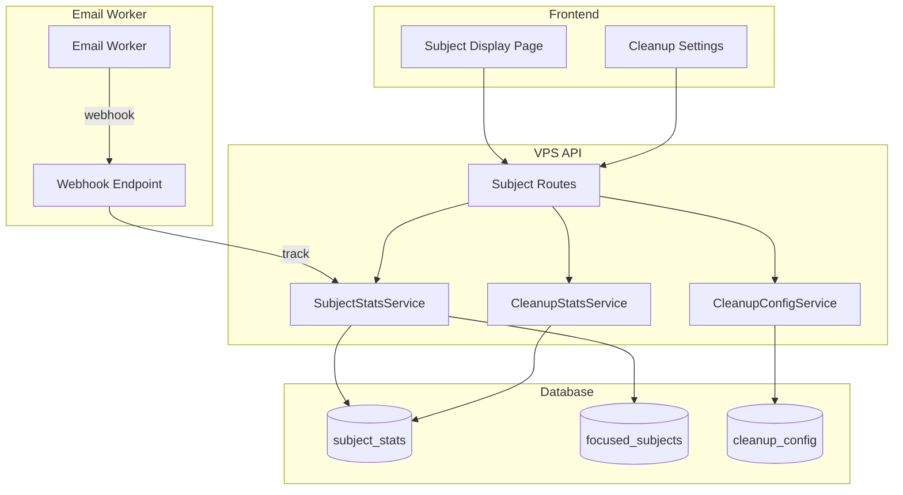

# Design Document: Email Subject Display

## Overview

本模块为邮件过滤系统添加邮件主题展示功能，用于统计和展示系统处理的所有邮件主题信息。该功能位于营销分析模块之后，提供对所有处理邮件（包括拦截和转发）的主题级别统计和管理。

### 核心功能
- 邮件主题数据自动收集（基于现有邮件处理流程）
- 主题统计列表展示（支持多Worker实例分行显示）
- 主题筛选和排序（按实例、数量）
- 主题操作（删除、重点关注、批量删除）
- 数据清理设置集成（存储统计、保留时间配置）

### 设计约束
- 复用现有的邮件处理webhook流程
- 与营销分析模块保持界面风格一致
- 支持多Worker实例数据隔离和聚合

## Architecture



### 数据流
1. Email Worker 处理邮件时，通过现有webhook发送邮件元数据到 VPS API
2. VPS API 在处理webhook时，同时记录邮件主题统计
3. SubjectStatsService 负责主题数据的存储和查询
4. 管理员通过前端页面查看主题统计、执行操作
5. 清理任务定期清理过期的主题统计数据

## Components and Interfaces

### 1. SubjectStatsService

核心服务类，负责邮件主题统计的所有逻辑。

```typescript
interface SubjectStatsService {
  // 数据记录
  trackSubject(data: TrackSubjectDTO): TrackSubjectResult;
  
  // 查询
  getSubjectStats(filter?: SubjectStatsFilter): SubjectStatsList;
  getSubjectById(id: string): SubjectStat | null;
  
  // 操作
  deleteSubject(id: string): boolean;
  deleteSubjects(ids: string[]): number;
  setFocused(id: string, focused: boolean): SubjectStat | null;
  
  // 统计
  getStorageStats(): SubjectStorageStats;
  
  // 清理
  cleanupOldStats(retentionDays: number): number;
}
```

### 2. API Routes

```typescript
// 主题统计相关
GET    /api/subjects                    // 获取主题统计列表
GET    /api/subjects/:id                // 获取单个主题详情
DELETE /api/subjects/:id                // 删除单个主题
POST   /api/subjects/batch-delete       // 批量删除主题
POST   /api/subjects/:id/focus          // 设置/取消重点关注

// 存储统计（集成到现有cleanup路由）
GET    /api/admin/cleanup/stats         // 获取存储统计（包含subject_stats）
PUT    /api/admin/cleanup/config        // 更新清理配置（包含主题保留时间）
```

### 3. Frontend Components

- SubjectDisplayPage: 主题展示主页面
- SubjectTable: 主题列表表格组件
- SubjectFilters: 筛选控件组件
- SubjectActions: 操作按钮组件

## Data Models

### Database Schema

```sql
-- 邮件主题统计表
CREATE TABLE IF NOT EXISTS subject_stats (
  id TEXT PRIMARY KEY,
  subject TEXT NOT NULL,                  -- 邮件主题
  subject_hash TEXT NOT NULL,             -- 主题哈希（用于快速查找）
  merchant_domain TEXT NOT NULL,          -- 商户域名
  worker_name TEXT NOT NULL,              -- Worker实例名称
  email_count INTEGER DEFAULT 1,          -- 邮件数量
  is_focused INTEGER DEFAULT 0,           -- 是否重点关注
  first_seen_at TEXT NOT NULL,            -- 首次出现时间
  last_seen_at TEXT NOT NULL,             -- 最后出现时间
  created_at TEXT NOT NULL,
  updated_at TEXT NOT NULL,
  UNIQUE(subject_hash, merchant_domain, worker_name)
);

CREATE INDEX IF NOT EXISTS idx_subject_stats_hash ON subject_stats(subject_hash);
CREATE INDEX IF NOT EXISTS idx_subject_stats_merchant ON subject_stats(merchant_domain);
CREATE INDEX IF NOT EXISTS idx_subject_stats_worker ON subject_stats(worker_name);
CREATE INDEX IF NOT EXISTS idx_subject_stats_focused ON subject_stats(is_focused);
CREATE INDEX IF NOT EXISTS idx_subject_stats_count ON subject_stats(email_count);
CREATE INDEX IF NOT EXISTS idx_subject_stats_last_seen ON subject_stats(last_seen_at);
```

### TypeScript Types

```typescript
/** 主题统计记录 */
interface SubjectStat {
  id: string;
  subject: string;
  subjectHash: string;
  merchantDomain: string;
  workerName: string;
  emailCount: number;
  isFocused: boolean;
  firstSeenAt: Date;
  lastSeenAt: Date;
  createdAt: Date;
  updatedAt: Date;
}

/** 聚合后的主题统计（用于列表展示） */
interface AggregatedSubjectStat {
  subject: string;
  subjectHash: string;
  merchantDomain: string;
  totalEmailCount: number;
  isFocused: boolean;
  firstSeenAt: Date;
  lastSeenAt: Date;
  workerStats: WorkerSubjectStat[];
}

/** 单个Worker的主题统计 */
interface WorkerSubjectStat {
  workerName: string;
  emailCount: number;
  lastSeenAt: Date;
}

/** 主题统计筛选条件 */
interface SubjectStatsFilter {
  workerName?: string;           // 按Worker筛选
  isFocused?: boolean;           // 按重点关注筛选
  sortBy?: 'emailCount' | 'lastSeenAt' | 'firstSeenAt';
  sortOrder?: 'asc' | 'desc';
  limit?: number;
  offset?: number;
}

/** 主题统计列表响应 */
interface SubjectStatsList {
  items: AggregatedSubjectStat[];
  total: number;
  limit: number;
  offset: number;
}

/** 记录主题的输入 */
interface TrackSubjectDTO {
  subject: string;
  sender: string;
  workerName: string;
  receivedAt?: string;
}

/** 记录主题的结果 */
interface TrackSubjectResult {
  id: string;
  isNew: boolean;
  emailCount: number;
}

/** 主题存储统计 */
interface SubjectStorageStats {
  totalRecords: number;
  totalSubjects: number;
  totalEmailCount: number;
  focusedCount: number;
  oldestRecordDate: Date | null;
  newestRecordDate: Date | null;
  workerDistribution: { workerName: string; count: number }[];
}
```

## Correctness Properties

*A property is a characteristic or behavior that should hold true across all valid executions of a system-essentially, a formal statement about what the system should do. Properties serve as the bridge between human-readable specifications and machine-verifiable correctness guarantees.*

### Property 1: Subject Tracking Records All Fields
*For any* valid email with subject, sender, and worker name, tracking that email should result in a record containing all these fields correctly stored.
**Validates: Requirements 1.1**

### Property 2: Email Count Accumulation
*For any* subject tracked multiple times with the same subject hash, merchant domain, and worker name, the email count should equal the number of times it was tracked.
**Validates: Requirements 1.2**

### Property 3: Multi-Worker Instance Isolation
*For any* subject tracked from multiple worker instances, each worker instance should have its own independent count, and the total count should equal the sum of all worker counts.
**Validates: Requirements 1.3, 2.2**

### Property 4: Domain Extraction Consistency
*For any* valid email address, extracting the domain should return the root domain portion after the @ symbol in lowercase.
**Validates: Requirements 1.4**

### Property 5: List Response Contains Required Fields
*For any* query to the subject stats API, all returned items should contain subject, merchant domain, worker stats with counts, and focus status.
**Validates: Requirements 2.1**

### Property 6: Pagination Correctness
*For any* paginated query with limit and offset, the returned items count should not exceed the limit, and subsequent pages should not overlap with previous pages.
**Validates: Requirements 2.4**

### Property 7: Worker Filter Consistency
*For any* query with a specific worker name filter, all returned subject stats should only include data from that worker instance.
**Validates: Requirements 3.2**

### Property 8: Sort Order Correctness
*For any* query with sort by email count, the returned items should be ordered correctly (ascending or descending) by their total email count.
**Validates: Requirements 3.3**

### Property 9: Delete Removes Record
*For any* existing subject stat, deleting it should result in the record no longer being retrievable.
**Validates: Requirements 4.1**

### Property 10: Focus Mark Round-Trip
*For any* subject stat, marking it as focused and then unfocusing should return it to the non-focused state.
**Validates: Requirements 4.2, 4.3**

### Property 11: Batch Delete Removes All Selected
*For any* set of subject stat IDs, batch deleting them should result in none of the records being retrievable.
**Validates: Requirements 4.4**

### Property 12: Focus Filter Consistency
*For any* query with focus filter enabled, all returned subject stats should have the matching focus status.
**Validates: Requirements 5.2**

### Property 13: Storage Stats Accuracy
*For any* set of subject stats in the database, the storage stats should accurately reflect the total record count and date range.
**Validates: Requirements 6.1, 6.2**

### Property 14: Retention Config Validation
*For any* retention configuration input, the validation function should accept values within 1-365 days and reject values outside this range.
**Validates: Requirements 6.3**

### Property 15: Cleanup Removes Old Records
*For any* set of subject stats with various timestamps and a configured retention period, after cleanup execution, no records older than the cutoff date should remain.
**Validates: Requirements 6.4**

## Error Handling

### API Errors
- 400 Bad Request: 缺少必填字段或数据格式错误
- 404 Not Found: 主题统计记录不存在
- 500 Internal Server Error: 数据库操作失败

### Data Validation
- 主题字符串不能为空
- Worker名称必须是有效的实例名称
- 保留天数必须在1-365范围内

## Testing Strategy

### Unit Testing
- 使用 Vitest 进行单元测试
- 测试 SubjectStatsService 的核心方法
- 测试域名提取、哈希计算等工具函数

### Property-Based Testing
- 使用 fast-check 库进行属性测试
- 每个属性测试运行至少 100 次迭代
- 测试数据生成器覆盖各种边界情况
- 每个属性测试必须标注对应的设计文档属性编号

### Integration Testing
- 测试 API 端点的完整流程
- 测试与现有webhook的集成
- 测试清理任务的执行

### Test Coverage Goals
- 核心服务方法: 90%+
- API 路由: 80%+
- 工具函数: 100%

