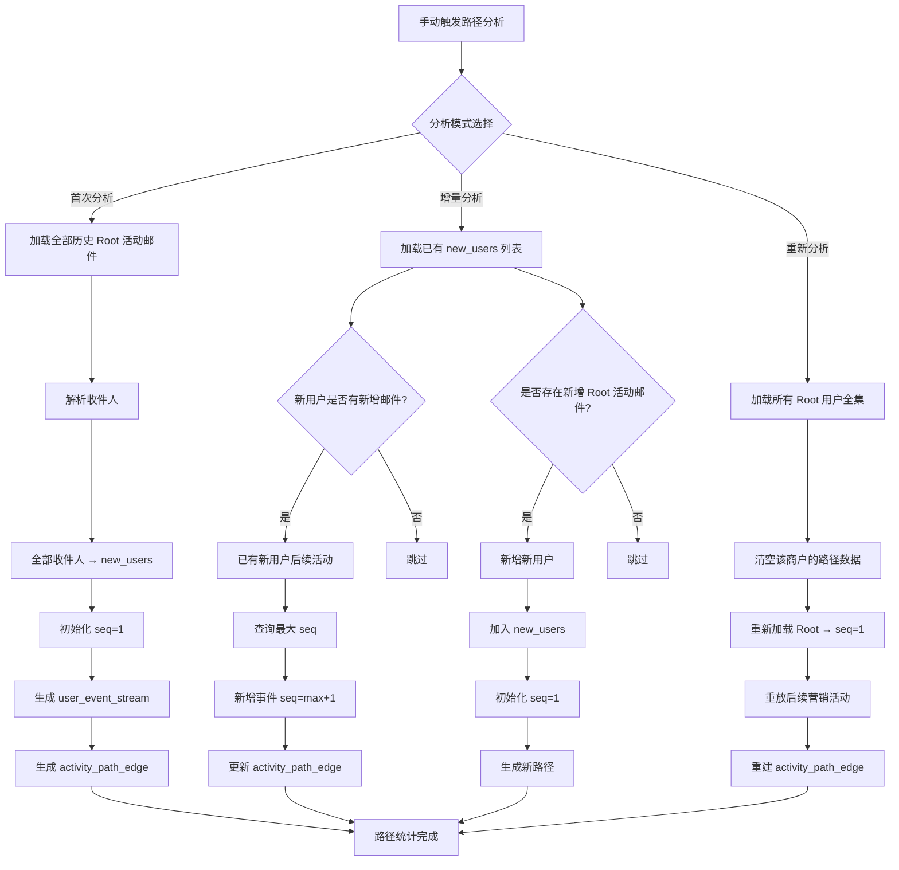

# Requirements Document

## Introduction

本文档重新梳理路径分析算法的核心逻辑和数据流程。路径分析的目标是追踪"新用户"从首次收到Root活动邮件开始，后续接收各个营销活动的路径流向。

**核心概念：**
- **新用户（new_users）**: 收到Root活动邮件的收件人，是路径分析的追踪对象
- **用户事件流（user_event_stream）**: 新用户收到的每封邮件记录，包含seq序列号
- **活动路径边（activity_path_edge）**: 从活动A到活动B的转移统计

**三种分析模式：**

**核心数据表：**
1. `project_root_campaigns` - 项目的Root活动配置
2. `project_new_users` - 项目的新用户列表
3. `project_user_events` - 用户事件流（recipient + campaign_id + seq）
4. `project_path_edges` - 路径边（from_campaign → to_campaign + user_count）

## Glossary

- **Root Campaign（Root活动）**: 分析的起点活动，通常是欢迎邮件或首次营销邮件，用户确认后生效
- **New User（新用户/new_users）**: 收到Root活动邮件的收件人，是路径分析的追踪对象
- **User Event Stream（用户事件流/user_event_stream）**: 新用户收到的每封邮件记录，包含seq序列号
- **Sequence Number（seq）**: 用户接收活动的顺序编号，Root邮件为seq=1，后续邮件依次递增
- **Activity Path Edge（活动路径边/activity_path_edge）**: 从活动A到活动B的转移，记录有多少用户经历了这个转移
- **Level（层级）**: 活动在路径中的深度，Root活动为Level 1
- **Coverage（覆盖率）**: 某活动的用户数占总新用户数的百分比
- **首次分析**: 项目首次运行分析，处理所有历史数据
- **增量分析**: 基于上次分析时间，只处理新增数据
- **重新分析**: 清空现有数据，重新执行首次分析流程

## Requirements

### Requirement 1: Root活动管理

**User Story:** As a data analyst, I want to configure Root campaigns for a project, so that the system knows which campaigns mark the start of a user journey.

#### Acceptance Criteria

1. WHEN a user sets a campaign as Root THEN the System SHALL store it in project_root_campaigns table
2. WHEN a user confirms a Root campaign THEN the System SHALL mark is_confirmed=1
3. WHEN displaying Root campaigns THEN the System SHALL show both confirmed and unconfirmed (candidates)
4. WHEN a project has multiple Root campaigns THEN the System SHALL treat any of them as valid starting points
5. WHEN a Root campaign is removed THEN the System SHALL require re-analysis to update paths

### Requirement 2: 新用户识别

**User Story:** As a data analyst, I want the system to identify new users based on Root campaigns, so that I can track their journey from the beginning.

#### Acceptance Criteria

1. WHEN a recipient receives a Root campaign email THEN the System SHALL add them to new_users table
2. WHEN adding a new user THEN the System SHALL record their first_root_campaign_id
3. WHEN a recipient already exists in new_users THEN the System SHALL NOT add them again
4. WHEN calculating new user count THEN the System SHALL count all recipients in project_new_users
5. WHEN multiple Root campaigns exist THEN the System SHALL treat any Root email as a valid entry point

### Requirement 3: 事件流构建

**User Story:** As a data analyst, I want the system to build a chronological event stream for each new user, so that I can see their complete journey.

#### Acceptance Criteria

1. WHEN a new user is added THEN the System SHALL create a seq=1 event for their Root email
2. WHEN processing subsequent emails for a new user THEN the System SHALL query max(seq) and assign seq=max+1
3. WHEN the same campaign is received multiple times THEN the System SHALL only record the first occurrence
4. WHEN building events THEN the System SHALL only include emails within the project's worker scope
5. WHEN querying events THEN the System SHALL return them ordered by seq ascending
6. WHEN a new user has no subsequent emails THEN the System SHALL only have the seq=1 Root event

### Requirement 4: 路径边生成

**User Story:** As a data analyst, I want the system to generate path edges from event streams, so that I can see transition patterns between campaigns.

#### Acceptance Criteria

1. WHEN a user has events seq=n and seq=n+1 THEN the System SHALL create/update a path edge
2. WHEN counting transitions THEN the System SHALL count distinct users who made each transition
3. WHEN displaying path edges THEN the System SHALL include campaign subjects for readability
4. WHEN rebuilding paths THEN the System SHALL clear existing edges and regenerate from events
5. WHEN a transition has zero users THEN the System SHALL NOT create a path edge for it

### Requirement 5: 层级统计

**User Story:** As a data analyst, I want to see campaigns organized by level, so that I can understand the depth of user journeys.

#### Acceptance Criteria

1. WHEN calculating levels THEN the System SHALL assign Level 1 to all Root campaigns
2. WHEN a campaign is reached from Level N THEN the System SHALL assign it Level N+1
3. WHEN a campaign can be reached from multiple levels THEN the System SHALL use the minimum level
4. WHEN displaying level stats THEN the System SHALL show user count and coverage for each campaign
5. WHEN no path exists to a campaign THEN the System SHALL NOT include it in level stats

### Requirement 6: 首次分析流程

**User Story:** As a data analyst, I want to perform initial analysis that processes all historical data, so that I can establish a complete baseline.

#### Acceptance Criteria

1. WHEN last_analysis_time is NULL THEN the System SHALL perform full analysis
2. WHEN performing full analysis THEN the System SHALL load all historical Root campaign emails
3. WHEN processing Root emails THEN the System SHALL parse all recipients and add them to new_users
4. WHEN adding new users THEN the System SHALL initialize seq=1 for each user's Root email
5. WHEN building events THEN the System SHALL generate user_event_stream for all subsequent emails
6. WHEN building paths THEN the System SHALL generate activity_path_edge from event sequences
7. WHEN analysis completes THEN the System SHALL update last_analysis_time
8. WHEN analysis completes THEN the System SHALL return statistics (newUsersAdded, eventsCreated, edgesUpdated)

### Requirement 7: 增量分析流程

**User Story:** As a data analyst, I want to perform incremental analysis that only processes new data, so that analysis is fast and efficient.

#### Acceptance Criteria

1. WHEN last_analysis_time is NOT NULL THEN the System SHALL perform incremental analysis
2. WHEN starting incremental analysis THEN the System SHALL load existing new_users list
3. WHEN checking for new Root emails THEN the System SHALL query emails received after last_analysis_time
4. WHEN new recipients receive Root emails THEN the System SHALL add them to new_users with seq=1
5. WHEN existing new users have new emails THEN the System SHALL query max(seq) and add events with seq=max+1
6. WHEN no new emails exist for a user THEN the System SHALL skip processing for that user
7. WHEN incremental analysis completes THEN the System SHALL update activity_path_edge
8. WHEN incremental analysis completes THEN the System SHALL update last_analysis_time

### Requirement 8: 重新分析功能

**User Story:** As a data analyst, I want to force a complete re-analysis, so that I can recalculate paths when Root campaigns change.

#### Acceptance Criteria

1. WHEN user triggers re-analysis THEN the System SHALL load all Root users (full set)
2. WHEN re-analysis starts THEN the System SHALL clear all project path data (new_users, events, edges)
3. WHEN re-analysis runs THEN the System SHALL reload Root emails and initialize seq=1
4. WHEN re-analysis runs THEN the System SHALL replay all subsequent campaign emails
5. WHEN re-analysis runs THEN the System SHALL rebuild activity_path_edge
6. WHEN re-analysis completes THEN the System SHALL display updated statistics

