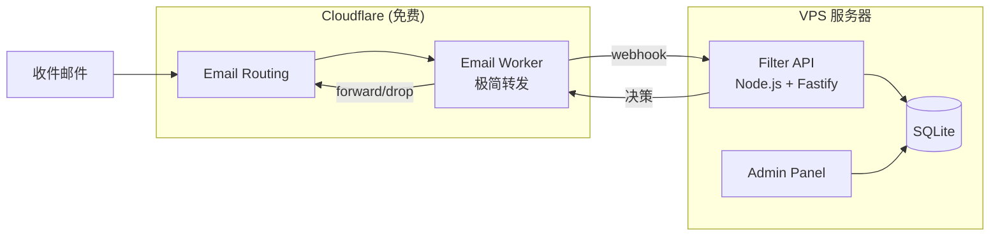
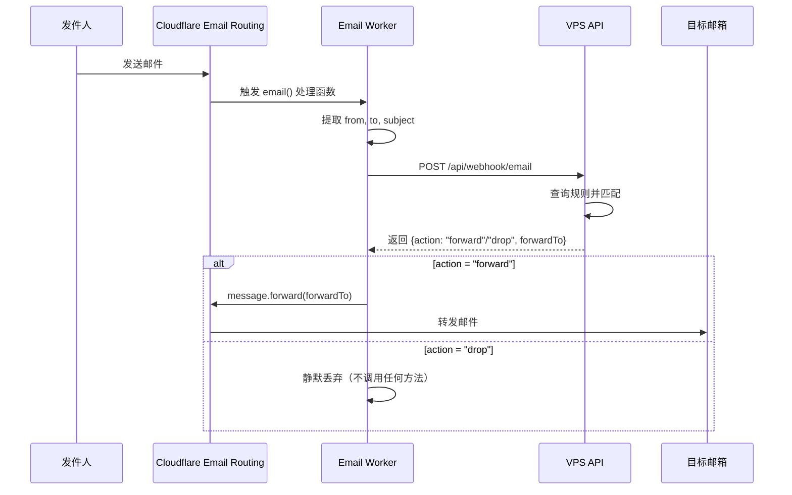

# Design Document

## Overview

本设计将邮件过滤系统迁移到 VPS 部署架构，保留 Cloudflare Email Routing 用于邮件接收。核心思路是让 Cloudflare Worker 尽可能轻量（仅做邮件转发），所有业务逻辑和数据存储都在 VPS 上完成。

### 架构图



### 邮件处理流程



### 处理流程说明

1. **邮件到达 Cloudflare**：Email Routing 接收邮件，触发 Worker
2. **Worker 提取信息**：仅提取 from、to、subject（不解析邮件体）
3. **调用 VPS API**：发送 webhook 请求到 VPS
4. **VPS 处理决策**：
   - 查询所有启用的规则
   - 按优先级匹配（白名单 > 黑名单 > 动态规则）
   - 更新统计数据
   - 返回决策结果
5. **Worker 执行动作**：
   - `forward`：调用 `message.forward(forwardTo)` 转发到目标邮箱
   - `drop`：直接返回，不调用任何方法（静默删除）
6. **降级处理**：如果 VPS 不可达，Worker 直接转发到默认地址

## Architecture

### 组件职责

| 组件 | 位置 | 职责 | 资源消耗 |
|------|------|------|----------|
| Email Worker | Cloudflare | 接收邮件，调用 webhook，执行转发/丢弃 | 极低（<10ms CPU） |
| Filter API | VPS | 规则匹配、动态规则、统计、所有业务逻辑 | 主要 |
| Admin Panel | VPS | 实例管理、系统配置 | 低 |
| SQLite DB | VPS | 数据持久化 | 主要 |

### 技术选型

- **VPS 框架**: Fastify（比 Express 更快，更适合 API）
- **数据库**: SQLite + better-sqlite3（同步 API，简单高效）
- **Email Worker**: 原生 Cloudflare Workers（无框架，最小体积）
- **部署**: Docker Compose 或 systemd

## Components and Interfaces

### 1. Email Worker (Cloudflare)

极简实现，仅包含必要逻辑：

```typescript
interface EmailWebhookPayload {
  from: string;
  to: string;
  subject: string;
  messageId: string;
  timestamp: number;
}

interface FilterDecision {
  action: 'forward' | 'drop';
  forwardTo?: string;
  reason?: string;
}
```

Worker 代码结构：
```
email-worker/
├── src/
│   └── index.ts      # 单文件实现
├── wrangler.toml
└── package.json
```

### 2. Filter API (VPS)

```
vps-api/
├── src/
│   ├── index.ts              # 入口
│   ├── config.ts             # 配置管理
│   ├── db/
│   │   ├── index.ts          # 数据库初始化
│   │   ├── schema.sql        # 表结构
│   │   ├── rule-repository.ts
│   │   ├── stats-repository.ts
│   │   └── watch-repository.ts
│   ├── services/
│   │   ├── filter.service.ts
│   │   ├── email.service.ts
│   │   ├── stats.service.ts
│   │   └── dynamic-rule.service.ts
│   ├── routes/
│   │   ├── webhook.ts        # 邮件 webhook 接口
│   │   ├── rules.ts
│   │   ├── stats.ts
│   │   └── health.ts
│   └── middleware/
│       └── auth.ts           # Token 认证
├── package.json
├── tsconfig.json
├── Dockerfile
└── docker-compose.yml
```

### 3. Admin Panel (VPS)

```
vps-admin/
├── src/
│   ├── index.ts
│   ├── db/
│   │   └── index.ts
│   ├── routes/
│   │   ├── auth.ts
│   │   ├── instances.ts
│   │   └── frontend.ts
│   └── middleware/
│       └── auth.ts
├── package.json
└── Dockerfile
```

### API 接口定义

#### Webhook 接口 (POST /api/webhook/email)

```typescript
// Request
{
  "from": "sender@example.com",
  "to": "recipient@example.com", 
  "subject": "Email Subject",
  "messageId": "unique-id",
  "timestamp": 1702500000000
}

// Response
{
  "action": "forward" | "drop",
  "forwardTo": "user@gmail.com",
  "reason": "Matched blacklist rule: spam"
}
```

#### 规则管理接口

| 方法 | 路径 | 描述 |
|------|------|------|
| GET | /api/rules | 获取所有规则 |
| GET | /api/rules/:id | 获取单个规则 |
| POST | /api/rules | 创建规则 |
| PUT | /api/rules/:id | 更新规则 |
| DELETE | /api/rules/:id | 删除规则 |
| POST | /api/rules/:id/toggle | 切换启用状态 |

#### 统计接口

| 方法 | 路径 | 描述 |
|------|------|------|
| GET | /api/stats | 获取总体统计 |
| GET | /api/stats/rules | 获取规则命中统计 |

## Data Models

### SQLite 表结构

```sql
-- 过滤规则表
CREATE TABLE IF NOT EXISTS filter_rules (
  id TEXT PRIMARY KEY,
  category TEXT NOT NULL CHECK(category IN ('whitelist', 'blacklist', 'dynamic')),
  match_type TEXT NOT NULL CHECK(match_type IN ('sender', 'subject', 'domain')),
  match_mode TEXT NOT NULL CHECK(match_mode IN ('exact', 'contains', 'startsWith', 'endsWith', 'regex')),
  pattern TEXT NOT NULL,
  enabled INTEGER NOT NULL DEFAULT 1,
  created_at TEXT NOT NULL,
  updated_at TEXT NOT NULL,
  last_hit_at TEXT
);

-- 规则统计表
CREATE TABLE IF NOT EXISTS rule_stats (
  rule_id TEXT PRIMARY KEY,
  total_processed INTEGER NOT NULL DEFAULT 0,
  deleted_count INTEGER NOT NULL DEFAULT 0,
  error_count INTEGER NOT NULL DEFAULT 0,
  last_updated TEXT NOT NULL,
  FOREIGN KEY (rule_id) REFERENCES filter_rules(id)
);

-- 邮件主题追踪表（用于动态规则）
CREATE TABLE IF NOT EXISTS email_subject_tracker (
  id INTEGER PRIMARY KEY AUTOINCREMENT,
  subject_hash TEXT NOT NULL,
  subject TEXT NOT NULL,
  received_at TEXT NOT NULL
);

CREATE INDEX IF NOT EXISTS idx_subject_tracker_hash ON email_subject_tracker(subject_hash);
CREATE INDEX IF NOT EXISTS idx_subject_tracker_received ON email_subject_tracker(received_at);

-- 动态规则配置表
CREATE TABLE IF NOT EXISTS dynamic_config (
  key TEXT PRIMARY KEY,
  value TEXT NOT NULL
);

-- 转发配置表
CREATE TABLE IF NOT EXISTS forward_config (
  id INTEGER PRIMARY KEY CHECK(id = 1),
  default_forward_to TEXT NOT NULL,
  updated_at TEXT NOT NULL
);

-- 监控规则表
CREATE TABLE IF NOT EXISTS watch_rules (
  id TEXT PRIMARY KEY,
  name TEXT NOT NULL,
  match_type TEXT NOT NULL,
  match_mode TEXT NOT NULL,
  pattern TEXT NOT NULL,
  enabled INTEGER NOT NULL DEFAULT 1,
  created_at TEXT NOT NULL,
  updated_at TEXT NOT NULL
);

-- 监控统计表
CREATE TABLE IF NOT EXISTS watch_stats (
  rule_id TEXT PRIMARY KEY,
  hit_count INTEGER NOT NULL DEFAULT 0,
  last_hit_at TEXT,
  FOREIGN KEY (rule_id) REFERENCES watch_rules(id)
);
```

### Admin Panel 数据库

```sql
-- Worker 实例表
CREATE TABLE IF NOT EXISTS instances (
  id TEXT PRIMARY KEY,
  name TEXT NOT NULL,
  api_url TEXT NOT NULL,
  api_key TEXT NOT NULL,
  created_at TEXT NOT NULL,
  updated_at TEXT NOT NULL
);

-- 管理员配置
CREATE TABLE IF NOT EXISTS admin_config (
  key TEXT PRIMARY KEY,
  value TEXT NOT NULL
);
```


## Error Handling

### Email Worker 错误处理

| 错误场景 | 处理方式 |
|----------|----------|
| VPS API 不可达 | 直接转发邮件到默认地址，不重试 |
| VPS API 返回错误 | 直接转发邮件到默认地址 |
| 超时（>5秒） | 直接转发邮件到默认地址 |

### VPS API 错误处理

| 错误场景 | HTTP 状态码 | 响应 |
|----------|-------------|------|
| 认证失败 | 401 | `{"error": "Unauthorized"}` |
| 请求格式错误 | 400 | `{"error": "Invalid request"}` |
| 规则不存在 | 404 | `{"error": "Rule not found"}` |
| 数据库错误 | 500 | `{"error": "Internal error"}` |

## Correctness Properties

*A property is a characteristic or behavior that should hold true across all valid executions of a system-essentially, a formal statement about what the system should do. Properties serve as the bridge between human-readable specifications and machine-verifiable correctness guarantees.*

### Property 1: 规则 CRUD 一致性
*For any* 有效的过滤规则数据，创建后应能通过 ID 查询到相同的数据，更新后应反映新值，删除后应无法查询到。
**Validates: Requirements 3.1, 3.3, 3.4**

### Property 2: 规则启用状态切换
*For any* 过滤规则，切换启用状态后，enabled 字段应变为相反值。
**Validates: Requirements 3.5**

### Property 3: 白名单优先级
*For any* 同时匹配白名单和黑名单规则的邮件，系统应返回 "forward" 动作（白名单优先）。
**Validates: Requirements 4.3**

### Property 4: 黑名单过滤
*For any* 仅匹配黑名单规则的邮件，系统应返回 "drop" 动作。
**Validates: Requirements 4.2**

### Property 5: 默认转发
*For any* 不匹配任何规则的邮件，系统应返回 "forward" 动作到默认地址。
**Validates: Requirements 4.4**

### Property 6: 匹配模式正确性
*For any* 规则和邮件组合，exact/contains/startsWith/endsWith/regex 匹配模式应按预期工作。
**Validates: Requirements 4.5**

### Property 7: 统计计数递增
*For any* 处理的邮件，相关规则的统计计数应递增，且时间戳应更新。
**Validates: Requirements 5.1, 5.3**

### Property 8: 级联删除
*For any* 被删除的规则，其关联的统计记录也应被删除。
**Validates: Requirements 3.4, 5.4**

### Property 9: 动态规则自动创建
*For any* 在时间窗口内收到超过阈值数量的相同主题邮件，系统应自动创建动态规则。
**Validates: Requirements 6.1**

### Property 10: 动态规则过期清理
*For any* 超过过期时间未命中的动态规则，清理时应被删除。
**Validates: Requirements 6.2**

### Property 11: 动态规则时间戳更新
*For any* 被命中的动态规则，其 lastHitAt 应更新为当前时间。
**Validates: Requirements 6.3**

### Property 12: 动态规则禁用
*For any* 禁用动态规则功能时，无论邮件数量如何，都不应创建新的动态规则。
**Validates: Requirements 6.4**

### Property 13: 认证验证
*For any* webhook 请求，缺少或无效的 Bearer Token 应返回 401 状态码。
**Validates: Requirements 8.1, 8.2**

### Property 14: 实例管理
*For any* 有效的 Worker 实例数据，注册后应能查询到该实例。
**Validates: Requirements 7.2**

## Testing Strategy

### 测试框架选择

- **单元测试**: Vitest
- **属性测试**: fast-check
- **集成测试**: Vitest + supertest

### 单元测试覆盖

1. **Repository 层**: 数据库 CRUD 操作
2. **Service 层**: 业务逻辑（规则匹配、动态规则）
3. **Matcher 工具**: 各种匹配模式

### 属性测试要求

- 每个正确性属性对应一个属性测试
- 使用 fast-check 生成随机测试数据
- 每个属性测试运行至少 100 次迭代
- 测试注释格式: `**Feature: vps-email-filter, Property {number}: {property_text}**`

### 测试文件结构

```
vps-api/
├── src/
│   ├── db/
│   │   └── rule-repository.test.ts
│   ├── services/
│   │   ├── filter.service.test.ts
│   │   ├── email.service.test.ts
│   │   └── dynamic-rule.service.test.ts
│   └── utils/
│       └── matcher.test.ts
```

## Deployment

### 系统要求

- **操作系统**: Debian 12（推荐）或 Ubuntu 22.04
- **CPU**: 1 核
- **内存**: 512MB
- **存储**: 5GB
- **网络**: IPv4 或 IPv6

### 方式一：systemd 直接部署（推荐，省内存）

```bash
# 安装 Node.js 20
curl -fsSL https://deb.nodesource.com/setup_20.x | sudo bash -
sudo apt-get install -y nodejs

# 创建应用目录
sudo mkdir -p /opt/email-filter
sudo chown $USER:$USER /opt/email-filter

# 上传代码并安装依赖
cd /opt/email-filter
npm install --production

# 创建 systemd 服务
sudo tee /etc/systemd/system/email-filter-api.service << EOF
[Unit]
Description=Email Filter API
After=network.target

[Service]
Type=simple
User=www-data
WorkingDirectory=/opt/email-filter/vps-api
ExecStart=/usr/bin/node dist/index.js
Restart=on-failure
Environment=NODE_ENV=production
Environment=PORT=3000
Environment=DB_PATH=/opt/email-filter/data/filter.db
Environment=API_TOKEN=your-secret-token

[Install]
WantedBy=multi-user.target
EOF

# 启动服务
sudo systemctl daemon-reload
sudo systemctl enable email-filter-api
sudo systemctl start email-filter-api
```

### 方式二：Docker Compose（可选）

```yaml
# docker-compose.yml
version: '3.8'
services:
  api:
    build: ./vps-api
    ports:
      - "3000:3000"
    volumes:
      - ./data:/app/data
    environment:
      - NODE_ENV=production
      - PORT=3000
      - DB_PATH=/app/data/filter.db
      - API_TOKEN=${API_TOKEN}
    restart: unless-stopped

  admin:
    build: ./vps-admin
    ports:
      - "3001:3001"
    volumes:
      - ./data:/app/data
    environment:
      - NODE_ENV=production
      - PORT=3001
      - DB_PATH=/app/data/admin.db
      - ADMIN_PASSWORD=${ADMIN_PASSWORD}
    restart: unless-stopped
```

### 环境变量配置

```bash
# .env 文件
# VPS API
PORT=3000
DB_PATH=/opt/email-filter/data/filter.db
API_TOKEN=your-secret-token-here
DEFAULT_FORWARD_TO=your-email@gmail.com

# Admin Panel
ADMIN_PORT=3001
ADMIN_DB_PATH=/opt/email-filter/data/admin.db
ADMIN_PASSWORD=your-admin-password

# Dynamic Rules
DYNAMIC_ENABLED=true
DYNAMIC_TIME_WINDOW=60
DYNAMIC_THRESHOLD=5
DYNAMIC_EXPIRATION=48
```

### Cloudflare Email Worker 配置

```toml
# wrangler.toml
name = "email-filter-worker"
main = "src/index.ts"
compatibility_date = "2024-01-01"

[vars]
VPS_API_URL = "https://your-vps-domain.com/api/webhook/email"
VPS_API_TOKEN = "your-secret-token-here"
DEFAULT_FORWARD_TO = "your-email@gmail.com"

[[send_email]]
name = "SEB"
```

### IPv6 VPS 配置说明

如果使用纯 IPv6 VPS：

1. **域名配置**：添加 AAAA 记录指向 VPS IPv6 地址
2. **Cloudflare DNS**：可以开启代理（橙色云朵），这样 Worker 通过 Cloudflare 访问
3. **本地访问**：如果本地不支持 IPv6，可通过 Cloudflare Tunnel 访问管理面板

```bash
# 安装 cloudflared（可选，用于本地访问）
curl -L https://github.com/cloudflare/cloudflared/releases/latest/download/cloudflared-linux-amd64 -o cloudflared
chmod +x cloudflared
./cloudflared tunnel --url http://localhost:3001
```

