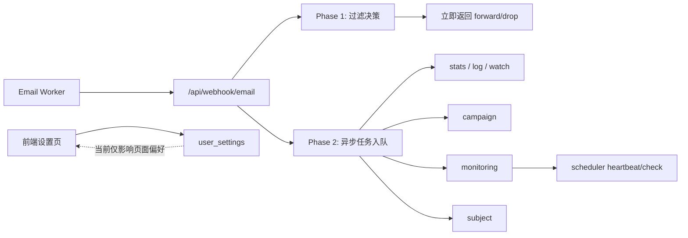
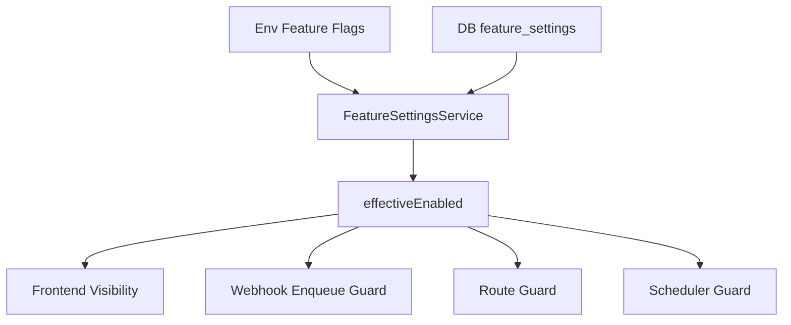

# 功能统一开关升级需求清单与设计规格

## 1. 文档信息

- 文档主题：营销分析、信号监控、邮件主题三项功能统一开关升级
- 适用项目：`email-filter`
- 文档类型：需求清单 + 设计规格（Spec）
- 文档日期：2026-05-17
- 当前状态：待实施

## 2. 背景

现有项目中，`营销分析`、`信号监控`、`邮件主题` 三项功能的启停语义不一致：

- `营销分析` 与 `信号监控` 在设置页中有开关，但当前只影响前端页面显示和自动刷新，不影响后端采集与处理。
- `邮件主题` 当前没有系统级功能开关，后端默认持续采集。
- 系统目前存在两类状态源：
  - 部署级状态：来自 env
  - 用户级状态：来自 `user_settings`
- 系统缺少第三层也是最关键的一层：
  - 系统级功能状态：用于控制后台是否实际启用功能

在当前单管理员、单用户场景下，这会导致实际行为与认知不一致：

- 页面里关闭了功能，但后台仍继续处理
- 功能重新打开和彻底禁用没有明确边界
- 三个功能的 API、页面、异步任务、调度器没有统一受控

## 3. 问题定义

### 3.1 已确认问题

1. 营销分析
- 前端设置项写入 `user_settings`
- 后端 webhook 是否 enqueue `campaign` 只看 env
- 页面关闭后后台仍继续产生营销分析数据

2. 信号监控
- 前端设置项写入 `user_settings`
- 后端 webhook 是否 enqueue `monitoring` 只看 env
- scheduler heartbeat 也只看部署配置
- 页面关闭后后台仍继续处理监控逻辑

3. 邮件主题
- 没有独立系统级开关
- `/api/subjects` 默认可访问
- webhook 默认持续 enqueue `subject`
- 后台持续写入主题统计

### 3.2 根因

系统将“页面偏好”和“后台功能启停”混用，缺少统一的系统级 feature lifecycle。

## 4. 升级目标

本次升级目标不是单独修补 3 个功能，而是补齐统一的功能开关治理架构。

升级后应满足以下目标：

1. 为 `营销分析`、`信号监控`、`邮件主题` 提供统一的系统级开关。
2. 保留 env 作为部署能力层，默认保持开启，便于后台日常关闭和重新打开。
3. 设置页中的功能状态应真实影响后台行为，而不只是 UI。
4. 页面显示、API 可用性、异步任务入队、scheduler 执行必须基于同一套有效状态计算。
5. 升级不影响核心邮件过滤主链。

## 5. 范围

### 5.1 In Scope

- `campaignAnalytics`
- `signalMonitoring`
- `subjectTracking`
- 后端 feature settings 数据层
- feature status 服务层
- webhook 入队控制
- 相关 API 的运行时 feature guard
- monitoring scheduler 的运行时开关控制
- 前端设置页和 tab 可见性逻辑
- 旧配置迁移

### 5.2 Out of Scope

- 核心邮件过滤规则逻辑重构
- 历史数据自动清理
- 关闭后补采历史邮件数据
- 多用户权限体系设计
- 前端整体 UI 重构

## 6. 关键约束

1. 当前项目只有单个用户，且该用户是管理员。
2. 需要支持在后台随时关闭和重新打开功能。
3. 为了方便启停，部署层 env 应默认保持开启。
4. 关闭功能只影响新数据处理，不删除历史数据。
5. 不允许因本次升级影响主过滤链路的转发/拦截结果。

## 7. 术语定义

### 7.1 部署级开关

来自 env 的功能能力开关，表示当前实例是否安装或支持某功能。

### 7.2 系统级开关

持久化在数据库中的后台开关，表示当前是否真正启用某功能。

### 7.3 有效状态

最终实际生效的功能状态：

```text
effectiveEnabled = envEnabled && systemEnabled
```

### 7.4 功能标识

- `campaignAnalytics`
- `signalMonitoring`
- `subjectTracking`

## 8. 需求清单

### 8.1 功能需求

#### FR-01 统一系统级开关

系统必须为以下三个功能提供统一的系统级开关：

- 营销分析
- 信号监控
- 邮件主题

#### FR-02 统一状态计算

系统必须为每个功能计算统一状态，包括：

- `envEnabled`
- `systemEnabled`
- `effectiveEnabled`
- `reason`

#### FR-03 关闭后停止后台处理

当功能被系统级关闭后：

- 营销分析不得继续 enqueue `campaign`
- 信号监控不得继续 enqueue `monitoring`
- 邮件主题不得继续 enqueue `subject`

#### FR-04 关闭后隐藏页面入口

当功能被系统级关闭后：

- 对应 tab 不显示
- 若用户当前正在该 tab，自动切回安全默认页

#### FR-05 关闭后 API 不可用

当功能被系统级关闭后：

- 对应 API 请求必须返回统一禁用态

#### FR-06 支持后台重新打开

当 env 允许时，管理员可以在页面中将系统级关闭状态重新切换为开启，且无需重启服务。

#### FR-07 部署禁用时不可后台开启

当 env 为关闭时：

- 页面中应显示“部署已关闭”
- 页面中不得允许将该功能强行开启

#### FR-08 信号监控调度接管

当 `signalMonitoring` 被系统级关闭时：

- heartbeat/check 不应继续执行业务逻辑

#### FR-09 邮件主题补齐系统级开关

`subjectTracking` 必须拥有与另外两个功能一致的部署级与系统级控制能力。

#### FR-10 单管理员简化模型

系统不再将这三个功能作为 `user_settings` 中的个人偏好项处理。

### 8.2 数据需求

#### DR-01 新增 feature settings 持久化

系统必须新增独立的数据表存储系统级功能状态。

#### DR-02 旧设置迁移

系统必须将旧设置中的以下字段迁移为系统级 feature 初始值：

- `campaignAnalyticsEnabled`
- `signalMonitoringEnabled`

#### DR-03 默认策略

若数据库中不存在 feature 记录，则系统应默认视为系统级开启。

### 8.3 接口需求

#### IR-01 提供查询接口

系统必须提供管理员接口查询所有功能状态。

#### IR-02 提供更新接口

系统必须提供管理员接口更新某一功能的系统级状态。

#### IR-03 提供统一错误结构

功能关闭后的 API 错误响应必须统一返回：

- `error`
- `feature`
- `reason`

### 8.4 非功能需求

#### NFR-01 兼容性

升级前后，核心邮件过滤主链行为必须保持一致。

#### NFR-02 稳定性

系统级功能关闭不应影响：

- 邮件拦截规则匹配
- 邮件转发
- 日志与基础统计

#### NFR-03 运维便利性

功能日常关闭和重新打开必须不依赖改 env 或重启服务。

#### NFR-04 可解释性

前端和后端必须明确区分：

- 系统关闭
- 部署关闭

## 9. 现有系统分析

### 9.1 当前结构

系统核心结构如下：

- `packages/email-worker`：邮件入口 Worker
- `packages/vps-api`：后端 API、管理前端、异步处理、调度器
- `packages/shared`：共享类型与通用定义

### 9.2 当前处理链



### 9.3 当前问题映射

- `campaignAnalytics`：假开关
- `signalMonitoring`：假开关
- `subjectTracking`：无开关

## 10. 目标架构设计

### 10.1 总体方案

引入统一功能开关架构：



### 10.2 状态模型

```ts
type FeatureKey = 'campaignAnalytics' | 'signalMonitoring' | 'subjectTracking';

interface FeatureStatus {
  key: FeatureKey;
  envEnabled: boolean;
  systemEnabled: boolean;
  effectiveEnabled: boolean;
  reason: 'enabled' | 'system_disabled' | 'env_disabled';
  updatedAt?: string;
}
```

### 10.3 数据模型

新增表：

```sql
CREATE TABLE IF NOT EXISTS feature_settings (
  key TEXT PRIMARY KEY,
  enabled INTEGER NOT NULL,
  updated_at TEXT NOT NULL
);
```

推荐初始 key：

- `campaignAnalytics`
- `signalMonitoring`
- `subjectTracking`

### 10.4 配置模型

env 配置：

- `CAMPAIGN_ANALYTICS_ENABLED=true`
- `SIGNAL_MONITORING_ENABLED=true`
- `SUBJECT_TRACKING_ENABLED=true`

说明：

- env 关闭表示部署硬禁用
- env 开启表示当前实例具备该功能能力

## 11. 服务设计

### 11.1 FeatureSettingsService

新增服务：

- `packages/vps-api/src/services/feature-settings.service.ts`

职责：

1. 读取数据库中的系统级开关
2. 读取 env 中的部署级能力开关
3. 计算统一 `FeatureStatus`
4. 提供更新接口

建议接口：

```ts
class FeatureSettingsService {
  getAllStatuses(): FeatureStatus[];
  getStatus(key: FeatureKey): FeatureStatus;
  isEnabled(key: FeatureKey): boolean;
  setEnabled(key: FeatureKey, enabled: boolean): FeatureStatus;
}
```

## 12. 后端设计

### 12.1 Webhook 接管

修改：

- `webhook.ts`

规则：

- `campaignAnalytics.effectiveEnabled=true` 才 enqueue `campaign`
- `signalMonitoring.effectiveEnabled=true` 才 enqueue `monitoring`
- `subjectTracking.effectiveEnabled=true` 才 enqueue `subject`

保持：

- `stats`
- `log`
- `watch`

不受本次升级影响。

### 12.2 API Feature Guard

对以下路由增加统一 guard：

- `/api/campaign/*`
- `/api/monitoring/*`
- `/api/subjects/*`

统一返回结构：

```json
{
  "error": "Feature disabled",
  "feature": "subjectTracking",
  "reason": "system_disabled"
}
```

### 12.3 路由注册策略

启动期：

- env=false：可不注册对应路由
- env=true：注册路由，但运行时仍受系统级开关控制

### 12.4 Scheduler Guard

对于 `signalMonitoring`：

- cron 仍可保留
- `runHeartbeat()` 开始前检查 feature 状态
- 若关闭则直接跳过业务执行

## 13. 前端设计

### 13.1 设置页改造

设置页中的三个功能项统一改为系统级开关：

- 营销分析
- 信号监控
- 邮件主题

不再写入 `user_settings`。

### 13.2 状态展示

每个功能显示三态：

- `已启用`
- `系统已关闭`
- `部署已关闭`

交互规则：

- 系统已关闭：允许重新打开
- 部署已关闭：控件置灰，仅提示说明

### 13.3 页面入口显示

页面 tab 显示必须依赖 `effectiveEnabled`，而不是旧用户偏好。

受控 tab：

- `campaign`
- `monitoring`
- `subjects`

## 14. 迁移设计

### 14.1 迁移目标

尽可能保持升级前后的真实使用状态一致。

### 14.2 迁移规则

1. 创建 `feature_settings` 表
2. 初始化系统级状态：
   - `campaignAnalytics` 从旧 `campaignAnalyticsEnabled` 迁移
   - `signalMonitoring` 从旧 `signalMonitoringEnabled` 迁移
   - `subjectTracking` 默认 `true`
3. 迁移完成后，旧字段不再参与业务判定

### 14.3 历史数据处理

本次升级：

- 不删除历史数据
- 不补采关闭期间数据
- 重新开启后只对新邮件生效

## 15. 实施任务拆解

### Phase A：基础设施

1. 新增 `feature_settings` 表
2. 新增迁移脚本
3. 新增 `FeatureSettingsService`
4. 为 `subjectTracking` 增加部署级 env
5. 新增管理员接口 `/api/admin/features`

### Phase B：后端接管

6. 修改 webhook 入队逻辑
7. 为 `campaign`、`monitoring`、`subjects` 增加 feature guard
8. 修改路由注册策略
9. 修改 scheduler heartbeat guard

### Phase C：前端切换

10. 设置页切换到系统级 feature 接口
11. 新增“邮件主题”开关
12. 三个 tab 的可见性统一绑定 `effectiveEnabled`

### Phase D：迁移与收尾

13. 迁移旧 `user_settings` 中的相关开关
14. 废弃旧字段的业务语义
15. 更新文档和说明

## 16. 验证方案

必须验证以下场景：

1. 关闭 `campaignAnalytics` 后，不再 enqueue `campaign`
2. 关闭 `signalMonitoring` 后，不再 enqueue `monitoring`
3. 关闭 `subjectTracking` 后，不再 enqueue `subject`
4. 关闭对应功能后，tab 不显示
5. 关闭对应功能后，对应 API 返回禁用态
6. `signalMonitoring` 关闭后 heartbeat 不再执行业务逻辑
7. 重新开启后，仅对新邮件恢复生效
8. env=false 时，页面显示“部署已关闭”
9. 主过滤链升级前后行为一致

## 17. 风险与缓解

### 风险 1：迁移后状态与原来不一致

缓解：

- 优先迁移旧值
- 无旧值时默认开启
- 升级前备份数据库

### 风险 2：前后端切换不同步

缓解：

- 采用后端先兼容、前端后切换的两步策略

### 风险 3：信号监控只停页面没停调度

缓解：

- heartbeat 增加运行时 guard

## 18. 上线策略

### 第一步：兼容上线

- 新增 feature settings 基础设施
- 默认所有功能保持开启
- 后端具备新能力，但不立即改变使用习惯

### 第二步：正式切换

- 前端设置页切换到系统级开关
- 页面显示、API、webhook、scheduler 全部统一受控

## 19. 回滚方案

### 19.1 配置级回滚

将 `feature_settings` 中三个功能全部置为 `true`。

### 19.2 版本级回滚

回滚代码版本，保留 `feature_settings` 表，不影响旧版本运行。

## 20. 验收标准

当以下条件全部满足时，本次升级视为验收通过：

1. 三个功能均具备系统级关闭与重新打开能力
2. 关闭后后台处理真正停止
3. 关闭后页面入口真正隐藏
4. 关闭后对应 API 不可访问
5. env 仍作为部署级能力硬门禁
6. 主过滤链无行为回归
7. 单管理员场景下设置语义清晰且可维护

## 21. 最终结论

本次升级应采用统一功能治理方案，而不是继续修补零散逻辑。

唯一推荐方案是：

- `env` 作为部署能力层
- `feature_settings` 作为唯一系统级启停源
- `webhook + route guard + scheduler + frontend` 全部接入统一 `effectiveEnabled`

该方案能够一次性解决：

- 营销分析“假开关”
- 信号监控“假开关”
- 邮件主题“无开关”

并为后续功能扩展提供统一治理基线。
