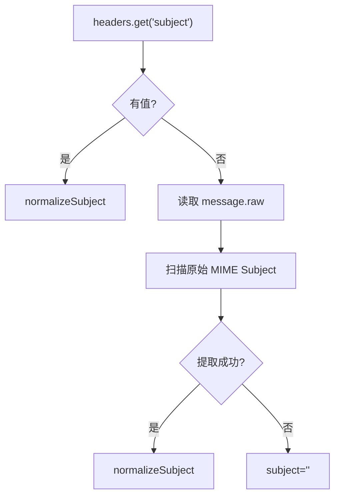
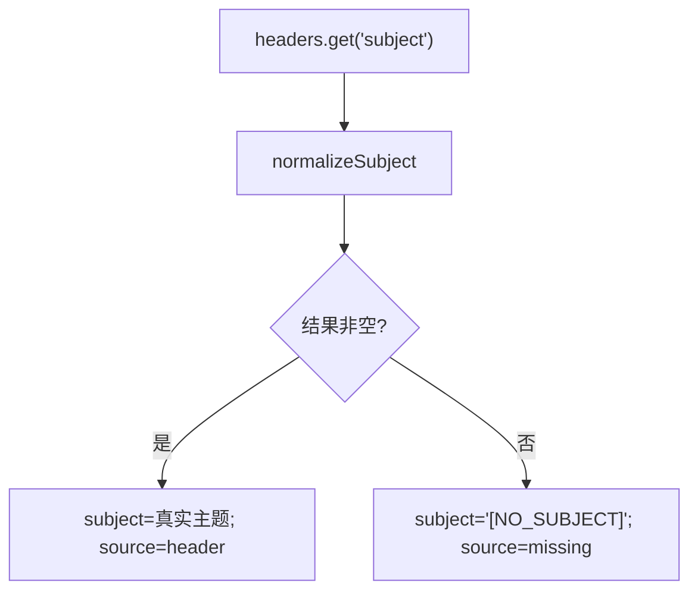
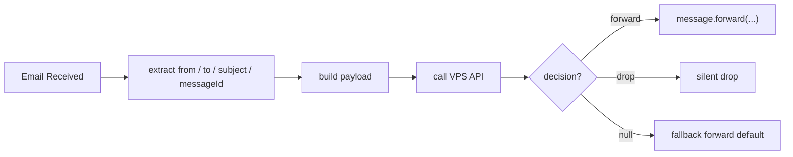

# Worker 主题获取回退升级设计规格

## 1. 文档信息

- 文档主题：Worker 主题获取回退与轻量兜底升级
- 适用项目：`email-filter`
- 文档类型：设计规格（Spec）
- 文档日期：2026-05-19
- 当前状态：待实施

## 2. 设计目标

本规格用于约束 Worker 端主题获取逻辑的回退升级实现。设计目标如下：

1. 保持邮件主热路径尽可能轻
2. 删除对 `message.raw` 的依赖
3. 尽可能保留正常主题识别能力
4. 在不改 API 的前提下保留空主题邮件的可过滤性
5. 不改变现有 VPS API 的接口结构

## 3. 现状分析

### 3.1 旧版 Worker 行为

旧版 Worker 在邮件入口中直接读取：

- `message.headers.get('subject') || ''`

特点：

- 快
- 简单
- 无 `raw` 读取副作用
- 但对异常邮件主题支持有限

### 3.2 当前 Worker 行为

当前 Worker 新增：

- `decodeMimeEncodedWord()`
- `normalizeSubject()`
- `extractSubjectFromRawHeaders()`
- `resolveSubject()`

处理流程为：



问题在于：

- `D/E` 步骤引入了对 `ReadableStream` 的主动消费
- 高流量时该链路明显不稳

## 4. 目标行为

### 4.1 新的主题解析模型

升级后 Worker 主题解析必须遵循如下规则：



### 4.2 行为说明

1. Worker 只从 `message.headers` 获取主题
2. Worker 保留轻量 RFC2047 UTF-8 解码
3. Worker 不再读取 `message.raw`
4. Worker 对空主题统一输出固定占位值
5. Worker 仍保留 `subjectSource` 元信息用于观测

## 5. 数据模型设计

### 5.1 Payload 兼容性

不修改共享类型结构，继续沿用现有字段：

```ts
interface EmailWebhookPayload {
  from: string;
  to: string;
  subject: string;
  messageId: string;
  timestamp: number;
  workerName?: string;
  subjectSource?: 'header' | 'raw-header-fallback' | 'missing';
  subjectRawHeader?: string;
}
```

### 5.2 新语义约束

虽然类型暂不收窄，但 Worker 端实现上应只产出以下值：

```ts
type WorkerSubjectSource = 'header' | 'missing';
```

具体规则如下：

| 场景 | subject | subjectSource | subjectRawHeader |
| --- | --- | --- | --- |
| header 有值，归一化后非空 | 真实主题 | `header` | 原始 header 值 |
| header 缺失或归一化后为空 | `[NO_SUBJECT]` | `missing` | `undefined` |

## 6. 函数级设计

### 6.1 保留函数

应保留以下函数：

- `decodeMimeEncodedWord(value: string): string`
- `normalizeSubject(value: string): string`
- `buildMinimalPayload(...)`

### 6.2 删除或废弃函数

应删除或废弃以下逻辑：

- `extractSubjectFromRawHeaders(message)`
- `resolveSubject()` 中的 raw fallback 分支
- 所有 `message.raw.getReader()` 调用

### 6.3 推荐新函数接口

建议将主题处理统一为单一轻量函数：

```ts
interface ResolvedSubjectResult {
  subject: string;
  subjectSource: 'header' | 'missing';
  subjectRawHeader?: string;
}

function resolveSubjectFromHeaders(message: ForwardableEmailMessage): ResolvedSubjectResult
```

处理规则：

1. 读取 `message.headers.get('subject')`
2. 为空时直接返回 `[NO_SUBJECT]`
3. 非空时执行 `normalizeSubject()`
4. 归一化后若仍为空，返回 `[NO_SUBJECT]`

## 7. 运行时设计

### 7.1 Worker 邮件主链

目标主链如下：



要求：

- 主题处理必须保持同步、轻量、无流读取
- 不引入额外异步 MIME 扫描

### 7.2 Debug Logging

要求：

1. 生产部署默认 `DEBUG_LOGGING=false`
2. 调试日志中可输出：
   - `Subject`
   - `Subject Source`
3. 不输出需要额外昂贵计算的信息

## 8. 配置设计

### 8.1 占位主题常量

建议新增常量：

```ts
const MISSING_SUBJECT_PLACEHOLDER = '[NO_SUBJECT]';
```

要求：

- 单点定义
- 测试中直接断言该常量行为
- 不允许多处散落魔法字符串

### 8.2 调试配置

校验以下配置：

- `DEBUG_LOGGING` 在生产默认关闭

若当前配置文件中默认开启，应在本轮升级中修正。

## 9. 兼容性设计

### 9.1 对 API 兼容

不修改：

- `/api/webhook/email` 请求结构
- 过滤决策响应结构
- 现有日志字段名

### 9.2 对规则系统兼容

现有 API 使用 `payload.subject` 做主题匹配。

因此：

- 正常主题邮件维持原有主题匹配能力
- 空主题邮件通过匹配 `[NO_SUBJECT]` 获得规则能力

### 9.3 对日志兼容

现有日志中仍可看到：

- `subject`
- `subjectSource`
- `subjectRawHeader`

但 `raw-header-fallback` 将不再出现于新数据。

## 10. 风险与缓解

### 风险 1：真实主题获取能力下降

说明：

- 原先部分可通过 raw fallback 补回的主题，现在会变为 `[NO_SUBJECT]`

缓解：

- 这是有意取舍，优先保证主链路稳定性
- 保留 header 解码能力，尽量覆盖正常邮件

### 风险 2：现有规则未覆盖 `[NO_SUBJECT]`

说明：

- 现有规则若完全依赖真实主题文本，空主题邮件可能需要新增一条规则

缓解：

- 升级说明中明确推荐为无主题邮件新增主题规则 `[NO_SUBJECT]`

### 风险 3：日志分析对 `raw-header-fallback` 有旧依赖

说明：

- 某些诊断方式可能预期该值继续出现

缓解：

- 文档中明确说明：新版本 Worker 不再产出该来源值

## 11. 测试规格

### 11.1 单元测试

必须覆盖：

1. 普通主题直接读取
2. RFC2047 UTF-8 Base64 编码主题解码
3. RFC2047 UTF-8 Q 编码主题解码
4. header 缺失时输出 `[NO_SUBJECT]`
5. header 存在但归一化后为空时输出 `[NO_SUBJECT]`
6. `subjectSource` 正确为 `header` 或 `missing`
7. `subjectRawHeader` 在 `missing` 时为空

### 11.2 回归测试

必须覆盖：

1. Worker 构建 payload 结构未破坏 API 兼容
2. `message.forward()` 正常流程仍可执行
3. fallback forward 流程不受影响
4. 不再存在任何 `raw-header-fallback` 相关行为断言

### 11.3 性能验证

至少完成以下检查：

1. 代码层确认无 `message.raw.getReader()` 调用
2. Worker 日志确认无 raw header 提取分支
3. 线上灰度后观察发送失败/拒绝比例变化

## 12. 灰度与回滚

### 12.1 灰度策略

建议流程：

1. 在测试环境部署 Worker 新版本
2. 定向发送正常主题邮件、编码主题邮件、空主题邮件
3. 观察 payload 与 API 决策
4. 线上灰度后重点观察高流量时段

### 12.2 回滚策略

若升级后主题匹配能力不可接受，可直接回滚 Worker 到前一版本。

回滚边界：

- 仅回滚 Worker
- 不需要回滚 API
- 不涉及数据库迁移

## 13. 验收定义

本次 Spec 验收通过需满足：

1. 设计完全限定在 Worker 侧
2. 热路径不再读取 `message.raw`
3. 空主题通过统一占位值承接
4. 与现有 API 协议保持兼容
5. 测试、灰度、回滚路径完整

## 14. 最终结论

本次升级不应继续追求“尽可能从 raw 中抢回所有主题”，而应明确采用稳定性优先策略：

- `headers` 可得则用真实主题
- `headers` 不可得则统一占位

这是在当前约束下，唯一兼顾性能、兼容性和可运维性的 Worker 侧方案。
