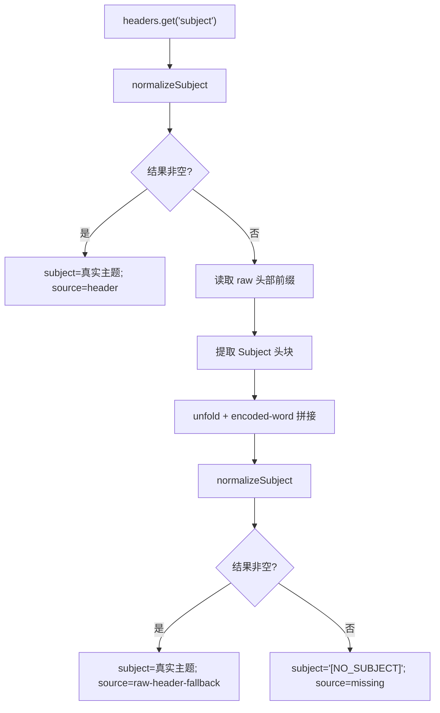

# Worker 主题按需 Raw Header Fallback 设计规格

## 1. 文档信息

- 文档主题：Worker 主题按需 raw header fallback
- 适用项目：`email-filter`
- 文档类型：设计规格（Spec Addendum）
- 文档日期：2026-05-22
- 当前状态：待实施

## 2. 设计结论

Worker 主题解析改为“双层模型”：

1. 快路径：优先读取 `message.headers.get('subject')`
2. 慢路径：仅在快路径缺失时读取 `message.raw` 的头部前缀，提取 `Subject:`

该设计只把异常邮件拉入慢路径，不把所有流量拉入 raw 解析。

## 3. 触发条件

raw fallback 仅在以下任一条件成立时触发：

1. `message.headers.get('subject') === null`
2. `normalizeSubject(headerSubject)` 结果为空串

除以上情况外，不允许读取 `message.raw`。

## 4. 数据流设计



## 5. 函数级设计

### 5.1 保留函数

- `decodeMimeEncodedWord(value: string): string`
- `buildMinimalPayload(...)`
- `extractEmail(from: string): string`

### 5.2 调整函数

#### `normalizeSubject(value: string): string`

新增两步预处理：

1. 处理 header continuation 折行
2. 消除相邻 encoded-word 之间的折行空白

建议规则：

```ts
value
  .replace(/\r?\n[ \t]+/g, ' ')
  .replace(/\?=\s+=\?/g, '?==?')
```

然后再进入 `decodeMimeEncodedWord()`。

### 5.3 新增函数

#### `readRawHeaderText(message: ForwardableEmailMessage): Promise<string>`

职责：

- 从 `message.raw` 读取头部前缀
- 遇到 `\r\n\r\n` 或 `\n\n` 时停止
- 限制最大读取字节数，避免把正文拉入内存

#### `collectHeaderBlocks(headersOnly: string, headerName: string): string[]`

职责：

- 扫描指定头名
- 合并 continuation 行
- 返回完整头块数组

#### `extractSubjectFromRawHeaders(message: ForwardableEmailMessage): Promise<string | undefined>`

职责：

- 调用 `readRawHeaderText()`
- 找出 `Subject:` 头块
- 去掉头名部分，只保留逻辑值
- 返回 raw fallback 使用的原始逻辑值

## 6. Payload 语义

Worker 端 `subjectSource` 恢复为以下三值：

```ts
type WorkerSubjectSource = 'header' | 'raw-header-fallback' | 'missing';
```

语义如下：

| 场景 | subject | subjectSource | subjectRawHeader |
| --- | --- | --- | --- |
| header 成功 | 真实主题 | `header` | 原始 header 值 |
| raw fallback 成功 | 真实主题 | `raw-header-fallback` | raw Subject 逻辑值 |
| header/raw 都失败 | `[NO_SUBJECT]` | `missing` | `undefined` |

## 7. 关键实现约束

### 7.1 不读取正文

raw fallback 只允许读取头部前缀，不允许：

- 读取完整邮件
- 扫描 MIME body part
- 解析 HTML 或 text/plain 正文

### 7.2 不做全量诊断日志

生产 Worker 不增加重型主题诊断日志。

只保留必要的轻量 debug 字段：

- `Subject`
- `Subject Source`

### 7.3 优先兼容现有 API

不修改：

- `/api/webhook/email` 路由
- 返回决策结构
- 数据库结构

## 8. 需要覆盖的真实失败模式

### 8.1 Macy’s 失败模式

需显式支持以下模式：

```text
Subject: =?UTF-8?B?...?=
	=?UTF-8?B?...?=
```

例如可恢复出：

- `Up to 60% off useful gifts for grads & dads 🎓👨‍`
- `Jewelry under $100 that you’re going to love`
- `How our top brands do men’s linen + save on women’s extras`

### 8.2 正常样本不回退

以下情况仍应直接走 header 快路径：

- Bloomingdale’s 单行编码主题
- Gmail 编码主题
- 普通 ASCII 主题

## 9. 风险与缓解

### 风险 1：raw fallback 重新引入性能压力

缓解：

- 只在 header 缺失时触发
- 只读头部前缀
- 不读正文

### 风险 2：折行处理不当导致主题多空格或拼接错误

缓解：

- 单元测试覆盖 continuation + 多段 encoded-word
- 显式测试真实 Macy’s 样本

### 风险 3：未来存在更多非标准 Subject 格式

缓解：

- 本轮只解决已确认样本
- 保持 fallback 函数边界清晰，便于继续扩展

