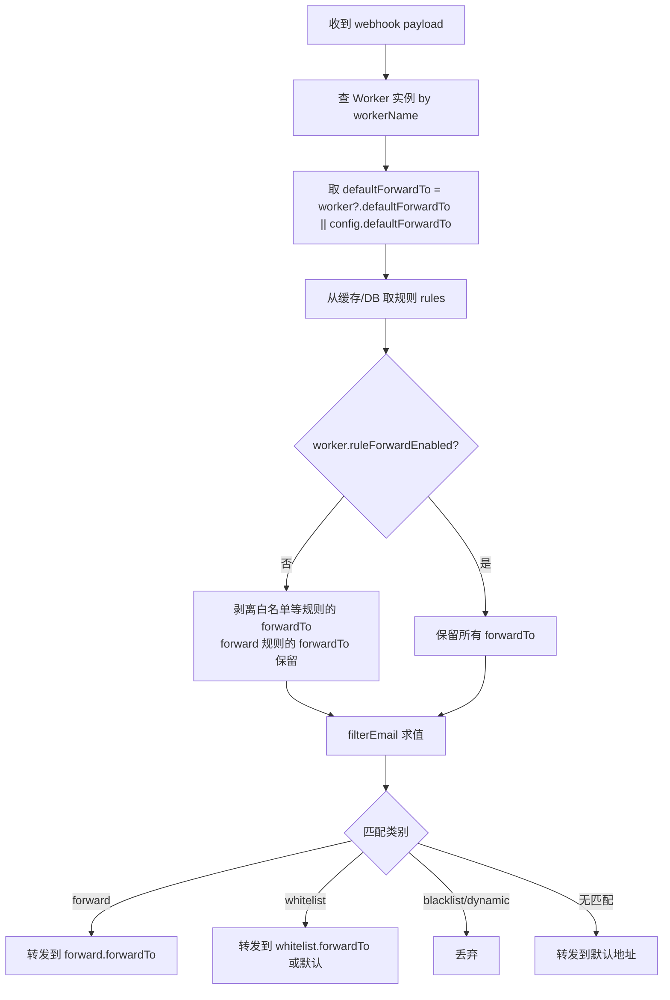

# 规则级转发地址覆写 — 设计规格

## 1. 文档信息

- 文档主题：规则级转发地址覆写与转发名单规则类别
- 适用项目：`email-filter`
- 文档类型：设计规格（Spec）
- 文档日期：2026-07-23
- 当前状态：已实施
- 关联需求：`2026-07-23-rule-forward-override-requirements.md`

## 2. 设计结论

转发地址控制采用**三层语义模型**：

1. **默认地址**：Worker 实例的 `defaultForwardTo`，回退到 `DEFAULT_FORWARD_TO` 环境变量。
2. **规则级覆写**：任意规则（白名单等）携带的 `forwardTo`，受 Worker 开关 `ruleForwardEnabled` 门控。
3. **forward 规则核心地址**：`forward` 类别规则的 `forwardTo`，最高优先级，不受开关门控。

关键设计点：`forward` 规则的 `forwardTo` 不是「覆写」而是「核心语义」，因此剥离逻辑只作用于白名单等规则的覆写 `forwardTo`，不触碰 `forward` 规则本身。

## 3. 过滤优先级

```
1. forward   (转发名单)   → 转发到 rule.forwardTo（必填，核心地址）
2. whitelist (白名单)     → 转发到 rule.forwardTo（若开关开）否则默认地址
3. blacklist (黑名单)     → 丢弃
4. dynamic   (动态规则)   → 丢弃
5. 无匹配                  → 转发到默认地址
```

实现位于 `packages/vps-api/src/services/filter.service.ts` 的 `filterEmail()`，`forward` 检查在最前。

## 4. 数据流设计



## 5. 关键实现约束

### 5.1 双层开关剥离逻辑(集中式实现)

转发地址策略由独立模块 `services/forward-resolver.ts` 统一管理，避免语义逻辑散落在 webhook/过滤引擎多处。`webhook.ts` 的 `processPhase1` 在取出规则后调用：

```ts
import { applyWorkerForwardPolicy } from '../services/forward-resolver.js';
// ...
rules = applyWorkerForwardPolicy(rules, !!worker?.ruleForwardEnabled);
```

`applyWorkerForwardPolicy` 的行为：

- **开关开启**：保留所有规则的 `forwardTo`。
- **开关关闭**（或 worker 未注册）：**仅剥离覆写地址**（白名单/黑名单/动态规则），**保留 forward 规则的核心地址**。
- 永不修改入参数组与元素（返回新对象数组），保证规则缓存不被污染。

核心判定函数 `isOverrideAddress(rule)` 集中了「哪些类别的 forwardTo 受门控」的语义：

```ts
export function isOverrideAddress(rule: FilterRule): boolean {
  return rule.category !== 'forward';
}
```

> 设计要点：剥离逻辑只作用于覆写地址；`forward` 规则的核心地址（`forwardTo`）**永不剥离**。这与旧实现（`rules.map(r => ({ ...r, forwardTo: undefined }))` 无差别剥离所有规则）有本质区别 —— 旧实现会让 forward 规则在开关关闭时退化为转发到默认地址，是一个已修复的缺陷。未来新增规则类别时，只需更新 `isOverrideAddress` 一处。

### 5.2 forward 规则的 forwardTo 回退

`filter.service.ts` 中 `forward` 匹配分支：

```ts
const forwardMatch = matchesForwardList(payload, grouped.forward);
if (forwardMatch) {
  return {
    action: 'forward',
    matchedRule: forwardMatch,
    matchedCategory: 'forward',
    forwardTo: forwardMatch.forwardTo || defaultForwardTo,
    ...
  };
}
```

即使 `forwardTo` 缺失（理论上不会发生，因创建校验拦截），也回退到默认地址，确保永不丢失转发动作。

### 5.3 规则创建校验

`routes/rules.ts` 中：

```ts
if (category === 'forward' && !forwardTo) {
  return { valid: false, error: 'forwardTo is required for forward rules' };
}
```

## 6. 数据库变更

### 6.1 迁移函数

| 迁移函数 | migrate.ts | 作用 |
| --- | --- | --- |
| `migrateFilterRulesForwardTo` | 669 | `filter_rules` 加 `forward_to TEXT` 列 |
| `migrateWorkerRuleForwardEnabled` | 688 | `worker_instances` 加 `rule_forward_enabled INTEGER NOT NULL DEFAULT 0` |
| `migrateFilterRulesForwardCategory` | 707 | 重建 `filter_rules` 表，CHECK 约束纳入 `'forward'` |
| `migrateFilterRulesUniqueForwardTo` | 768 | 用 UNIQUE INDEX 将 `COALESCE(forward_to,'')` 纳入唯一约束，允许同匹配条件不同转发地址 |

四个迁移均幂等：列已存在 / 约束已含 forward / 索引已存在时返回 `skipped`。第四个迁移用 UNIQUE INDEX + COALESCE 表达式（而非表级 UNIQUE），因为表级 UNIQUE 不支持表达式，且 COALESCE 把 NULL 归一为空串，使「无转发地址」的多条规则仍判为重复（保持原行为）。

### 6.2 最终 schema 要点

```sql
-- filter_rules
CREATE TABLE filter_rules (
  ...
  category TEXT NOT NULL CHECK(category IN ('whitelist', 'blacklist', 'dynamic', 'forward')),
  ...
  forward_to TEXT,        -- 规则级转发地址覆写
  ...
);

-- worker_instances
ALTER TABLE worker_instances ADD COLUMN rule_forward_enabled INTEGER NOT NULL DEFAULT 0;
```

## 7. 正确性属性

### Property A：forward 规则最高优先级

给定一个同时命中 forward 和 blacklist 的邮件，结果必须为 forward（转发），不得丢弃。

### Property B：白名单覆写受开关门控

- `ruleForwardEnabled = true` 时，白名单带 `forwardTo` 命中 → 转发到 `forwardTo`。
- `ruleForwardEnabled = false` 时，同规则命中 → 转发到默认地址（`forwardTo` 被剥离）。

### Property C：forward 规则必填 forwardTo

调用规则创建接口提交 `category=forward` 且 `forwardTo` 为空 → 返回 HTTP 400。

### Property D：升级向后兼容

未设置 `rule_forward_enabled` 的老 Worker 实例，迁移后值为 `0`，所有覆写被剥离，转发行为与升级前一致（全部走默认地址）。

### Property E：forwardTo 空白回退

任意规则的 `forwardTo` 为空串或纯空白时视为未设置，命中后回退默认地址（`filter.service.ts` 各分支均用 `rule.forwardTo || defaultForwardTo`）。

## 8. 风险与缓解

### 已修复：剥离逻辑误伤 forward 规则（历史缺陷）

**旧实现**：`webhook.ts` 用 `rules.map(r => ({ ...r, forwardTo: undefined }))` 无差别剥离所有规则的 forwardTo，包括 forward 规则。这导致开关关闭时 forward 规则退化为转发到默认地址，丧失定向能力。

**修复**：引入 `services/forward-resolver.ts`，剥离时通过 `isOverrideAddress(rule)` 跳过 forward 规则（其 forwardTo 为核心地址）。回归测试覆盖于 `forward-resolver.test.ts`。

### 风险 1：迁移重建 filter_rules 表锁库

缓解：迁移在事务内执行（`BEGIN TRANSACTION`），先建新表 `filter_rules_new`、`INSERT INTO ... SELECT *`、`DROP`、`RENAME`，最小化锁持有时间。第四个迁移（UNIQUE INDEX）不重建表，仅建索引，无锁库风险。

### 风险 2：规则缓存与剥离逻辑叠加

缓解：`applyWorkerForwardPolicy` 返回全新对象数组，不修改入参，缓存内容永不被污染；缓存失效（`ruleCache.invalidate`）在规则变更时触发，确保新规则即时生效。回归测试覆盖于 `forward-resolver.test.ts`（输入不可变性章节）。

### 风险 3：sql.js 测试环境不强制表达式 UNIQUE 约束

说明：sql.js（测试用，编译自旧版 SQLite）能创建 COALESCE 表达式 UNIQUE 索引，但不在插入时强制约束。因此 DB 级去重在测试中无法验证。生产环境 better-sqlite3（绑定原生 SQLite）正常强制。应用层 `findDuplicate` 作为双重保障，在所有环境生效。
